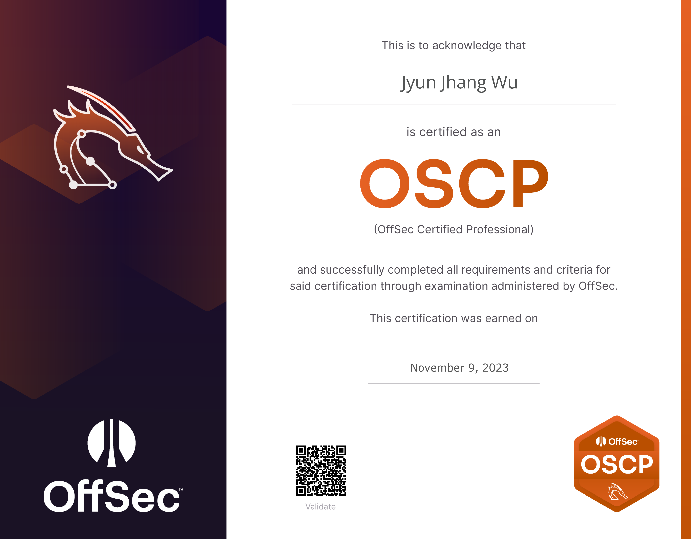

Tonya，在臺科大連讀了 6 年的學士 & 碩士的半路出家資安仔，理論上這邊應該充斥各種文章。











<h2 class="bold-text">2021</h2>

【全國大專校院資訊應用服務創新競賽】資安組佳作

<h2 class="bold-text">2022</h2>

【資安技能金盾獎】嶄露頭角獎

【國立臺灣科技大學】書卷獎

<h2 class="bold-text">2023</h2>

【戴夫寇爾】資訊安全獎學金

【資安技能金盾獎】嶄露頭角獎

【臺灣好厲駭】表現優異獎

<h2 class="bold-text">2024</h2>

【戴夫寇爾】資訊安全獎學金





<h2 class="bold-text">2022</h2>

【AIS3 Junior】扁...逆向那遊戲 0w0

<h2 class="bold-text">2023</h2>

【國立金門大學】從現實世界的 Edge Case 挖掘 Web 漏洞

【國立金門大學】Binary 自動化動態分析

【AIS3 Junior】神偷策士

【國立金門大學】逆向攻城

<h2 class="bold-text">2024</h2>

【國立金門大學】從 0 開始的滲透測試





<h2 class="bold-text">2022</h2>

【國立臺灣科技大學】資訊安全研究社 - 副社長





<h2 class="bold-text">2022</h2>

【CISC】MCU 韌體模擬系統調查及效率評估

<h2 class="bold-text">2023</h2>

【TANET】結合虛擬化 IoT 的軟體安全開發流程

【CISC】基於差分隱私的特徵選擇演算法在機器學習惡意程式檢測器上的應用

<h2 class="bold-text">2024</h2>

【CISC】透過上下文推斷的間接調用函數呼叫圖輔助的靜態分析





