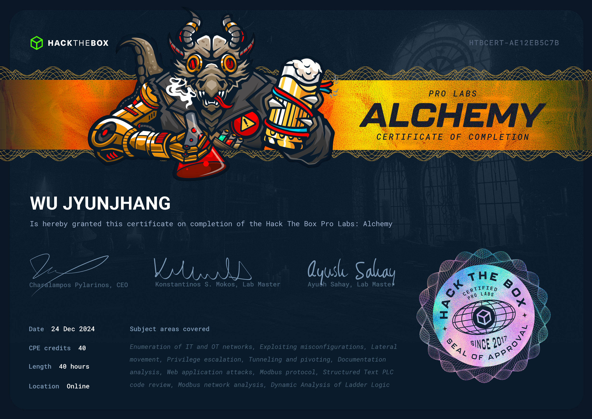

## 🦉 免責聲明
嗨，我不會在我的 Blog 內提供任何🚩，如果你是想來找🚩的話可以直接點擊右上角的❌了。我會在 Blog 分享我從 0 開始攻略 Pro Labs 的心路歷程與我所面對的困難點，也許能些微幫助到正在閱讀的你，如果你也在攻略 Pro Labs 並且卡關，也許這能讓你感覺到你不那麼孤單。

## 🦉 心得感想
Alchemy 是我的第一組 Standard Lab，是一間擬似🏭的環境，也就是說這是一個工控場域，因此在攻略這組 Lab 時你必須具備有 Modbus 的技能點。這組 Lab 最特別的地方在於能明顯感受到上下半場的差異，從 IT 環境進入 OT 環境時，攻略方式會有很明顯感受上的不同。這組 Lab 的難度是 Medium，但我想這個難度的定義應該是綜合難度，如果對於 OT 有研究的滲透測試人員來說，我想綜合難度可以直接降到 Easy。

在上半場的 IT 環境並沒有太多刁難，這也是由於工控場域比起🛡️更注意穩定運行的特質，因此不論是立足點或是提權皆沒有超出 OSCP 範圍，AD 方面，CRTP 的知識範圍已經非常夠用，針對這組 Lab 而言甚至有點溢出。此外，由於是擬似🏭，並且擬似的目標不是高科技及先進產業，也因此在特定方面極高度還原了工控場域可能會出現的情景，若是感覺到了向量，或是直覺判斷有機會就儘管大膽嘗試。

在下半場的 OT 環境對於剛接觸工控場域的人而言也許需要花費不少時間來入門，取得🚩的邏輯也與 IT 環境有所不同。對於 IT 環境來說，最大的威脅便是被駭客完全掌控機器，但對於 OT 環境而言，最大的威脅反而是穩定運行被破壞。也因此在攻略 OT 環境時，思考的邏輯需要轉換。另外，閱讀文件是非常重要的，這能夠幫助你更快速的理解你將要做的事情，儘管你不能 100% 信任所有的文件。

在 OT 環境中有幾隻🚩非常噁心，我並不是指取得方式，而是🚩的格式。我仍然不能理解為什麼需要這樣出題，這對我來說是純粹的苦工。並且，儘管是 OT 環境，但這並不代表你不能使用 IT 環境的技術。此外，在使用 HMI 時，我推薦大家發揮想像力去盡可能想像實際的場景，當你明晰了整個想像中的景色，你就不會錯過轉瞬即逝的🚩。

## 🦉 也許可以注意...

- [啤酒製程](https://youtu.be/2qHXkbLQVXs?si=VVy4Hw9bFtbX8LTR) 跟著文件一起看，看完再打 OT，信我🙂。
