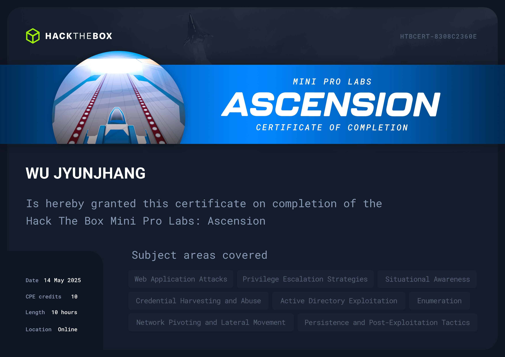

## 🦉 免責聲明
嗨，我不會在我的 Blog 內提供任何🚩，如果你是想來找🚩的話可以直接點擊右上角的❌了。我會在 Blog 分享我從 0 開始攻略 Pro Labs 的心路歷程與我所面對的困難點，也許能些微幫助到正在閱讀的你，如果你也在攻略 Pro Labs 並且卡關，也許這能讓你感覺到你不那麼孤單。

## 🦉 心得感想
Ascension 是一組 Mini Lab，而且非常不舒服。如果 RPG 的噁心是在你即將抵達終點線時把終點線往後拉，Ascension 就是告訴你終點在哪裡，但把你雙手雙腳綁住讓你爬過去。攻略這組 Lab 時你會看到那些在滲透測試中常見的向量，但是所有利用方式都被擋下來。使得你必須去翻大量文件找到那些正常的功能哪裡可能存在利用點。說過分不過分，但會有一種【原來還能這樣打】的感慨。

在攻略這組 Lab 時，最讓人感到不舒服的地方在於，後面的幾台機器都預設碰不到你的 Kali，並且被深深地埋在內網中。這使得你如果想做事，就必須乖乖的一層一層打回來。並且每台都有🧱，這使得在攻略途中會需要不斷思考是 payload 無法使用還是只是被🧱擋住。當你突破這些障礙好不容易將 `>_` 打回來，也許對面的🛡️每隔一段時間就 kill 掉你，或者你的 `>_` 極度不穩定。這使得在攻略過程的後段可以說是舉步維艱。

即使如此，這組 Lab 所用到的向量並不是特別刁鑽，只是在你正常攻略的過程讓你感受到極度的不舒服，如果去掉這種不舒服，僅題目來說約只有 Medium 的難度。但因為這種不舒服，他真的會跳到 Hard。建議在攻略時選擇有冷氣的房間，心平氣和的攻略。

## 🦉 也許可以注意...
- 不要生氣，真的，他不難，只是很不舒服。
- 試試看 [ligolo-ng](https://github.com/nicocha30/ligolo-ng)，SSH tunnel 雖然能用，但可能會抓狂。