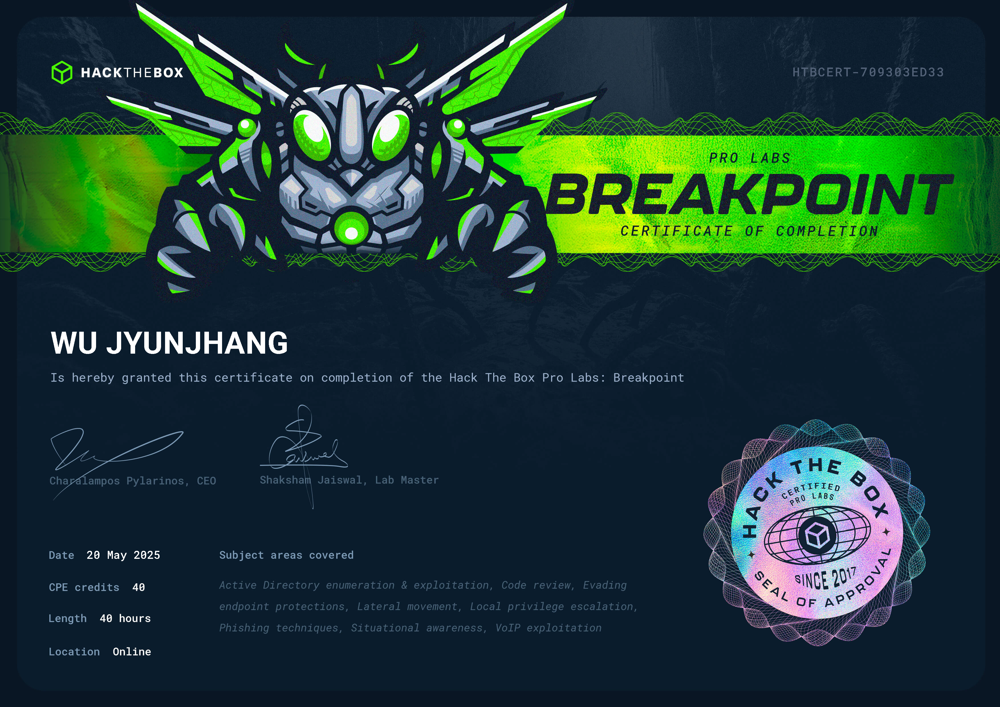

## 🦉 免責聲明
嗨，我不會在我的 Blog 內提供任何🚩，如果你是想來找🚩的話可以直接點擊右上角的❌了。我會在 Blog 分享我從 0 開始攻略 Pro Labs 的心路歷程與我所面對的困難點，也許能些微幫助到正在閱讀的你，如果你也在攻略 Pro Labs 並且卡關，也許這能讓你感覺到你不那麼孤單。

## 🦉 心得感想
Breakpoint 是一組 Standard Lab，並且也是我打過最難的 Lab。也許未來有朝一日當我面對 APT Lab 時我會改變心意，但就算 Breakpoint 不是第一，也一定是第二。攻略 Breakpoint 的難度幾乎是 RPG + Cybernetics 的集合體，每一隻🚩的向量不要說熟悉，連在漫長的 Lab 攻略之旅都不一定見過一面。在其他 Lab 能夠分成兩隻🚩的攻略向量，在 Breakpoint 只是取得一隻🚩的一步而已，而這種向量需要連續串  3~4 個才能取得🚩。

攻略這組 Lab，不僅需要去翻閱歷年登上過 BlackHat 上的研究者們的足跡，同時需要豐富的想像力。你需要找出自 20 年前就存在的協定規範並加以利用。在攻略過程也至少出現 2~3 次不同種類的進行中間人攻擊。當你好不容易取得了憑證，在成功取得 `>_` 之前不僅有🛡️更可能有多因素驗證。當你認定了某個向量的可能性，等在你面前的便是實現這個向量所需要具備的知識，而令人遺憾的是，這些向量通常沒有開源工具或程式碼供你使用。你必須獨自摸索並撰寫出能用的 payload。

此外，在攻略過程中也會出現用以迷惑你的向量。即使已經明確確定該向量不可行，但在仔細翻閱文件後卻又能找到幾乎沒有人注意到的 feature，而這細小的關鍵，卻是唯一一條的攻略路線。此外，攻略過程極度不線性，幾乎不可能推斷出下一個目標是什麼，因為更多的是需要依靠其他機器才能進入該目標，這也導致攻略過程彷彿在迷霧中尋找出路。

此外，有許多的憑證藏在枚舉的過程中，考驗你對機器枚舉的是否夠仔細，並且需要謹記，不是路途中的每一台機器都需要 root，也許需要在更後面的階段才能回頭來提權。也因此當你確定你已經完成應盡之事，不要留戀，去尋找下一個目標。

在攻略這組 Lab 時，你可以完全參考下一隻🚩的分數來判斷難易度，設計 Breakpoint 的人非常理解每一隻🚩的難度。大量的通靈是必須的，沒有通靈是無法繼續下去的。哪怕是最後你選擇了最有可能的方式，也可能因為各式各樣奇形怪狀的原因而失效。

最後，bloodhound 可以使用，但除非已經接近尾聲，否則幾乎沒有幫助。在此勸告後來者，如果你有攻略這組 Lab 的勇氣，你已經值得敬重。至於攻略完成會不會像 SAO 一樣需要兩年，我只能說，不無可能。

## 🦉 也許可以注意...
- 沒有什麼好注意的，全部都值得注意。
- 白皮書請看好看滿，並且建議做好假設後再去看。
- 比起在 github 上尋找不存在的工具，不如自己動手豐衣足食。