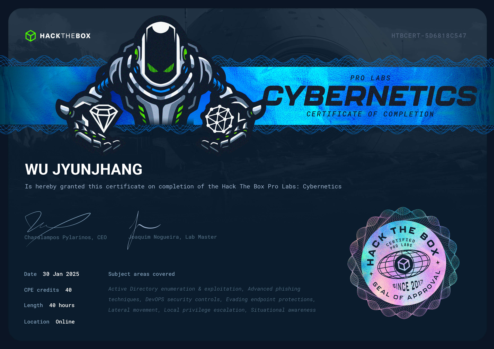

## 🦉 免責聲明
嗨，我不會在我的 Blog 內提供任何🚩，如果你是想來找🚩的話可以直接點擊右上角的❌了。我會在 Blog 分享我從 0 開始攻略 Pro Labs 的心路歷程與我所面對的困難點，也許能些微幫助到正在閱讀的你，如果你也在攻略 Pro Labs 並且卡關，也許這能讓你感覺到你不那麼孤單。

## 🦉 心得感想
Cybernetics 是我的第二組 Standard Lab，也是在攻略完這組 Lab 後，我就直接裸考 OSEP 了，足以見得這組的營養程度。但老實講，我更想在學完 OSEP 後再攻略這一組 Lab，會輕鬆非常多。如果你已經有 OSEP & CRTP，整個 Cybernetics 我認為你至少能攻略 80%，這組 Lab 的 AD 向量真的非常像這兩張證照。

難度毋庸置疑地配得上 Hard 這一難度。你不僅僅需要對 AD 有相當程度的熟悉度，更需要在大量的 Domain 內來回穿梭。在這一組 Lab 中，並不是將一個 Domain 全部攻克下來再前往下一個 Domain。你的視野會隨著攻略進度逐漸擴展，而可攻略範圍便是你目光所及之處。如果是第一次攻略 Standard Lab，需要特別注意這一點，Cybernetics 並不完全是線性的。

在複雜的 AD 架構下更加絕望的是，🛡️在大部分機器上是完全開啟的狀態。這也導致了也許平時的 `>_` 在某些機器上卻能夠正常運作，但在某幾台機器上面完全不會起作用，有機率導致你誤判向量。我建議隨時準備好替代方案，並且多方嘗試。此外，🧱也限制了你所能使用的埠，在推進攻略進度的同時也要學習掌控如何這些有限的資源。 我非常建議每取得一組新的 Domain 憑證就使用 bloodhound 枚舉一次。如果能夠邊攻略邊繪製 Domain 關係圖，能夠很大程度輔佐你，降低你迷失然後找不到方向的可能性。大部分的 AD 向量都能夠在 bloodhound 上找到，這也是為什麼我建議 bloodhound 必須隨著你的攻略進度更新。

這組 Lab 的立足點向量通常非常明確，沒有刻意刁難的情況產生。幸運的是，metasploit 儘管不是全程都有效的，但卻能在大部分的時間點幫助你。在枚舉過程中，我建議仔細地去枚舉你所能接觸的地方，也許在過去的經驗會告訴你這裡沒有有趣的向量，但我仍然建議你去看看。此外，當攻略進行到後半段，不可避免的會遭遇到 ADCS，這對於沒有學習過相關知識的人而言，需要花費大量的時間去研究。有些機器上甚至有嚴格的限制你的行為。甚至你使用的某些 payload 存活的時間非常短暫。其中最讓我印象深刻的莫過於即便已經成為 `NT AUTHORITY\SYSTEM`，也並不代表你掌握了這台機器。

## 🦉 也許可以注意...
- 🕧非常重要，沒有人喜歡不守時的人。
- 自己的 Windows 環境非常重要，幾乎不可能只靠 Kali 打完全程。
- 如果 metasploit 不管用了， [C2Matrix](https://docs.google.com/spreadsheets/d/1b4mUxa6cDQuTV2BPC6aA-GR4zGZi0ooPYtBe4IgPsSc/edit?gid=0#gid=0) 也許可以幫助你找到其他機會，我認為學習一個新的 C2 framework 是非常有性價比的。
- 如果能攻略這組 Pro Lab，別忘記去領取你的 OSEP 證照。

