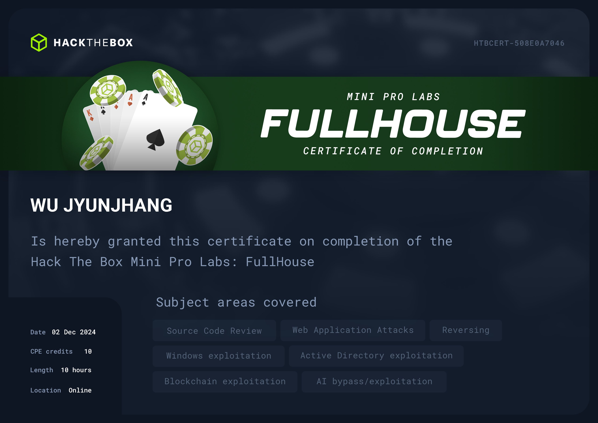

## 🦉 免責聲明
嗨，我不會在我的 Blog 內提供任何🚩，如果你是想來找🚩的話可以直接點擊右上角的❌了。我會在 Blog 分享我從 0 開始攻略 Pro Labs 的心路歷程與我所面對的困難點，也許能些微幫助到正在閱讀的你，如果你也在攻略 Pro Labs 並且卡關，也許這能讓你感覺到你不那麼孤單。

## 🦉 心得感想
FullHouse 是一組 Mini Lab，但對於一位正常的滲透測試人員來說，這一組 Lab 所涵蓋到的技能點幾乎與 OSCP 點出來的技能樹完全無關。攻略 FullHouse 會需要 AI 的技能點配合些微的 BlochChain 技能點，若不是本來就具有這方面的知識，在攻略這組 Lab 時可能會在某些環節卡關滿久的。其中，BlochChain 的技能點我認為並非必須，若你原本就具有一定程度 Code Review 的能力也許能有奇效，但最終你仍然會學習到 BlockChain 的基本原理。

在這組 Lab 中能玩到非常多好玩的向量，絕大部分都不是一般情況下會出現的，我反而覺得像是 Misc 類型的 CTF。隨著攻略進度，在後面卡關時會有【對耶這裡有這東西】【這東西居然是有用的嗎】的想法出現。

有一隻🚩，因為很兇的🛡️以及很惱人的原因，我硬生生測了三天三夜，把所有可能性都測過一輪了才找到正確的組合，不至於連這邊都有 Try Harder 吧🥲。

## 🦉 也許可以注意...
- 這是一個擬似的🎰環境，包含那些人員與設施。
- [GPT-SoVITS](https://github.com/RVC-Boss/GPT-SoVITS) 是我前陣子很喜歡玩的玩具，但或許你更喜歡擲🎲，畢竟這是個🎰環境，稍微賭一下也很合理。
- 🤖更新很快，🛡️也很兇，所以排列組合很重要。
- [impacket](https://github.com/fortra/impacket) 可以多準備幾個版本，別問，問就是前人的教訓🥲。

