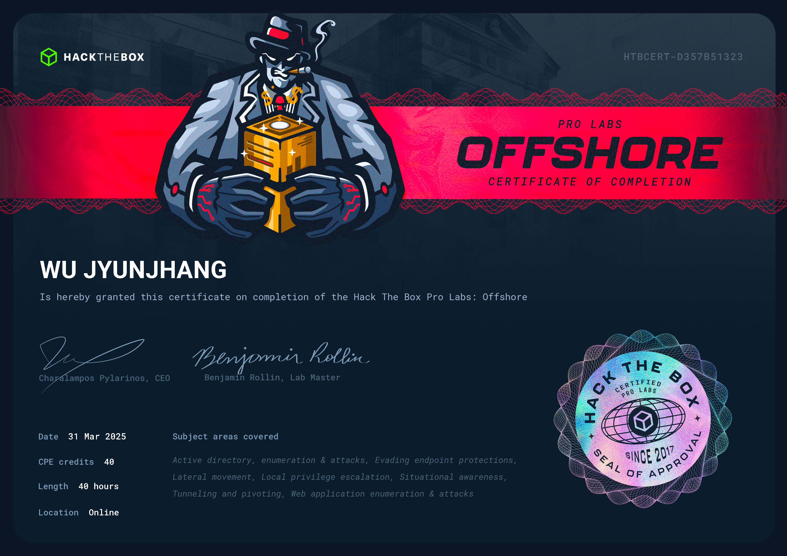

## 🦉 免責聲明
嗨，我不會在我的 Blog 內提供任何🚩，如果你是想來找🚩的話可以直接點擊右上角的❌了。我會在 Blog 分享我從 0 開始攻略 Pro Labs 的心路歷程與我所面對的困難點，也許能些微幫助到正在閱讀的你，如果你也在攻略 Pro Labs 並且卡關，也許這能讓你感覺到你不那麼孤單。

## 🦉 心得感想
Offshore 是我的第三組 Standard Lab，上一組則是 Cybernetics。老實說順序有點相反了，Offshore 是我在攻略完 Cybernetics 並取得 OSEP 後的第一組 Lab。這也就導致我在攻略 Offshore 時感覺非常順利，沒有遇到太多挑戰。

Offshore 可能也是 Pro Lab 中有最多🚩的一組了，有接近 40 隻。絕大部分都是 AD 向量，但沒有 Cybernetics 來的難。這組 Lab 所有 AD 向量都落在 CRTP 的範圍內。也就是說 bloodhound 上都能發現。Offshore 中的🛡️並不難繞過，使用基本的 AMSI bypass 就足以攻略該 Lab。比較有趣的是除了 AD 以外的向量，在攻略這組 Lab 時會見到許多的開源或商用軟體，而這些軟體的版本都具相對知名的 CVE。整體環境擬似於 IT 部門被裁撤或縮編的公司。

總體而言我非常推薦具有 OSCP 的人來挑戰這組 Pro Lab，不論是立足點或者權限提升都大約是 OSCP 等級。因此這組 Lab 能夠很好的幫助你熟練 AD 向量，在攻略完後再挑戰 Cybernetics 會是很好的選擇。千萬不要像我一樣逆著打回來🥲。

## 🦉 也許可以注意...

- 有一些🚩會藏在很微妙的地方，但不是繼續攻略的必要條件，建議等全部都完成後再回頭找。
- [AMSI bypass](https://shaquibizhar.github.io/Amsi-bypass-generator/) 能夠幫助你順利的進行攻略。