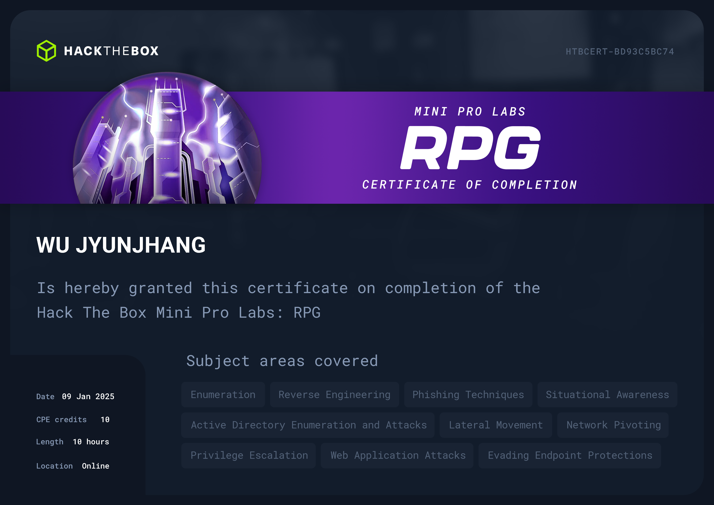

## 🦉 免責聲明
嗨，我不會在我的 Blog 內提供任何🚩，如果你是想來找🚩的話可以直接點擊右上角的❌了。我會在 Blog 分享我從 0 開始攻略 Pro Labs 的心路歷程與我所面對的困難點，也許能些微幫助到正在閱讀的你，如果你也在攻略 Pro Labs 並且卡關，也許這能讓你感覺到你不那麼孤單。

## 🦉 心得感想
RPG 是一組 Mini Lab，而且非常噁心。哪怕是現在我還是覺得這組是數一數二難的 Lab。光是一隻🚩可能就得串三到四個向量，而且能不能找的到向量還有高機率取決於你使用的工具。閱讀文件是基本，但從幾百頁的官方文件找到唯一一個能用的向量真的很過分。這組 Lab 甚至還有逆向工程的環節。此外，枚舉的過程也非常痛苦，當你好不容易走完以上流程，才發現這才只是題目意義上的剛開始，距離第一隻🚩還有一段距離。你繼續費盡千辛萬苦拿到了 root，才發現這台機器有兩隻🚩，而這僅僅只是第一隻。

此外，這組機器很常壞掉，重點是壞掉還感覺不出來，你只會認為是你找錯向量。🛡️更是別說，常用的工具基本上直接陣亡。大部分時候的進行方式都是不斷的以各種我沒學過的姿勢找憑證，即使取得憑證，有的時候還得通靈使用方式，更別提取得憑證的過程有多少要經過加解密。

這組 Lab 還有非常惡趣味的地方，常常在看似差一步取得🚩的地方用奇怪的方式搞你，硬生生要你多串一個向量才能拿到🚩，攻略起來非常的不舒服。你不斷的說服自己【就差一點了】【最後一步了】然後就一不小心看日出了。

## 🦉 也許可以注意...
- 最好當作沒有告訴你立足點的情況來開始攻略這組 Lab。

