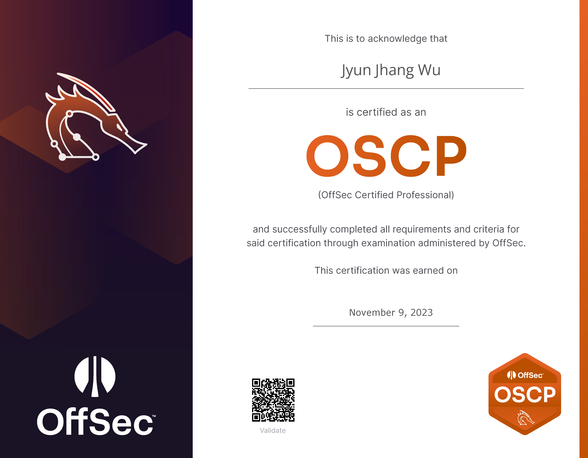

## 🦉 收穫

總學習時間約 60 天，總時數約 350 小時，考試耗時 16 小時。使用了 1 次考試機會，取得了 100 / 110 分。

## 🦉 心路歷程

2023 年 1 月，我決定考取 OSCP。距離我初次開始學習資安的起點 —— AIS3 ，正好 18 個月。一年半的時光聽起來很短，但似乎足夠一名學生在該領域初露鋒芒。但明顯地，我似乎沒能達到我理想中的目標。資安領域具有強者文化，在踏入這領域時我便看著強者的背影。我不認為這是一件壞事，正因為有強者，後來者才有了對未來的憧憬與追逐的目標。有一句話能很好地詮釋：『 長江後浪催前浪，一代新人換舊人 。』

背影是什麼？我會說那是一個追逐的目標，與里程碑不大相同。當你在前進時，背影也在前進。當你達成一個里程碑時，背影也同時取得了成就。或許有人會恐懼，因為到最後莫不是如夸父追日。沒錯，因為背影不會停下來等你。當你超越了背影的那刻，就換你成為其他人的背影了。這是一條漫漫長路，因為目的地或許在那燈火闌珊處，也或許是星辰大海的征途。因此在追逐背影的路途上需要有里程碑來幫助你看到自己前行的腳步，這也正是為什麼大部分初入資安的人會選擇 OSCP 作為自己的目標，因為那正是一個具有明確方向的里程碑。但也請深思，這個里程碑真的是必需的嗎？考取證照當然是目標，但絕對不是終點，更甚者也許只是起點。若在考證照的路途上失去了追逐的背影或迷失了方向，是否還有意義？

「我想學滲透測試嗎？」這個疑問產生的時間點是 2022 年 5 月，一次場域滲透測試的活動中。我當然不是一名滲透仔或者 Web 狗。在我剛開始學習資安時，Binary 是我的第一選擇。在打 CTF 時，Reverse 永遠是我第一個目標，在這之後才是 Web。理所當然，我在那個場域是做不了太多事情的。但如此近距離接觸滲透測試，作為學習的引燃點已經足矣。這聽起來便是我考 OSCP 的緣由，但我必須清楚的說明，學習滲透測試的起點從來就不只是 OSCP。

我第二次參與 AIS3 是以 Staff 的身份參加 AIS3 2022。與第一次參與的 AIS3 2021 不同，我聽得懂台上講師授課的內容了。沒錯，我第一次參加 AIS3 的時候，課程是有 80% ~ 90% 超出我的理解範圍的。而這次，有 80% ~ 90% 在我的理解範圍內。也正因為累積了足夠的里程並且得到了驗證，我才能回答上一個問題。「是，因為我覺得挖漏洞很有趣。」但緊接著便是一連串的問題。

「我真的需要 OSCP 嗎？我考得到嗎？」可能在讀這篇文的人很難想像，但這些問題直到考 OSCP 的前一個月我才得到解答。這份豁然開朗或許也幫助我取得了 OSCP。這些問題的答案來自 DEVCORE 的 Allen Own 與 Ginoah，至於他們怎麼回答的，雖然不是什麼值得賣關子的話題，但請讓我保密到本文的結尾。

## 🦉 學習過程

### 🍽️ 準備階段

以下是 Tonya 的食譜，請預先準備好以下材料，並依據個人口味斟酌調整配方。

- 1999 美金
- 4-6 小時的練習時間 x 90 天份
- ChatGPT
- Google 搜尋引擎
- Notion
- 修禪的心 x 1 顆 （正在就讀碩士建議準備 2 顆）

### 🍽️ 食材前處理

1. 用魔法小卡將 1999 美金交給 OffSec 以取得 365 天教材許可權與 2 次 OSCP 考試機會。
2. 在 90 天來臨前，預先看點教材來讓自己在學習時不至於手足無措。
3. 在行事曆上框出不會被奇怪事情抓去奇怪地方的 90 天，每天放入 4~6 小時練習時間。

### 🍽️ 漫長的靶 🐤 料理過程

1. 取出放入 4~6 小時練習時間的前 30 天，開始按照 OSCP 教材學習。
2. 在學習過程中，每一小節學習完畢後使用 Notion 將該節重點筆記下來，每一大節學習完畢後將筆記分類整理，並確保筆記在每日睡眠起床後仍是可讀狀態。請注意，記筆記的時間比學習時間長是正常的，接受不了的同學建議接受事實。
3. 取出放入 4~6 小時練習時間的後 60 天，取出修禪的心置於桌面上。開始嘗試利用前 30 天所學習到的知識與筆記料理靶機。
4. 一開始還不會料理靶機的同學可能會需要一整天才能料理 1 台靶機，請同學將料理過程寫成詳細的 WriteUp 放在 Notion 中以備不時之需。
5. 靶機開始展現出教材上完全沒有提到的東西，請同學取出 ChatGPT 與 Google 搜尋引擎開始自立自強。
6. 靶機展現出的姿勢卡了同學整整 1 天還沒有進度，請同學取出修禪的心開始一頓胖揍後接受事實，並且去睡一覺。
7. 睡一覺後有靈感的同學在料理完靶機後請繼續料理下一隻靶機。沒有靈感的同學可以到官方 Discord 查看提示。
8. 在料理第 10 ~15 隻靶機後同學會得到 BUFF，效果是在未來一定時間內料理靶機速度提升。該 BUFF 持續時間約為 10 隻靶機。請同學趁著 BUFF 爆發一波。
9. 在料理第 25 ~ 30 隻靶機時，靶機會召喚一面牆壁。請同學開始撞牆，會撞得頭破血流。同學務必取出修禪的心繼續撞、用力撞、撞開那面牆壁，建議同學在面對牆壁時盡可能不要請求援助，靠自己的力量撞牆，如果撞了 2、3 天還是撞不開的同學可以嘗試請求援助。
10. 撞開牆壁後的同學，在料理第 31~ 隻靶機時速度會提升，表示已經具有相應能力。同學可以不用料理完所有靶機便能準備預約 OSCP 考試。我料理完 40 隻靶機後便預約考試了。

## 🦉 叛逆的黑夜料理人 - Tonya

以下是 Tonya 在考試時的叛逆或者不叛逆的行為，替後來的同學驗證了一些奇怪的事情，如果有疑慮請務必不要參考。

1. 考試前預先詢問是否能使用 Notion 筆記，得到允許後考試時使用。
2. 考試中忘記詢問是否能使用 HackMD 筆記，考試時使用。
3. 每隔一小時就出去休息 10 分鐘。
4. 提早 8 小時結束考試去睡覺。
5. 把住在同一個房間的弟弟趕去睡客廳。
6. 每一台考試靶機都解兩次。第一次正常解、第二次邊解邊截圖。

## 🦉 鳴謝

在我的學習過程中，特別感謝兩位 GPT（Steven Meow GPT & Red Meow GPT）在我想不透的時候引導我許多切入點或教我很多奇怪的知識。我也再次驗證一件事，最重要跟最有用的知識從來就不在課本上。這也很契合 OSCP 的主旨，除了滲透測試的能力外要培養的便是獨立解決問題的能力。此外，修禪的心也非常重要，越急躁只會適得其反，望後來者能深切體會到這句話的重量。

## 🎃 來自 DEVCORE 的一小碗雞湯

- Allen Own ：『大家都在成長，知道自己的不足也是一種成長。』
- Ginoah：『對我們來說，所有技術都是為了挖洞。沒有什麼用不到的，滲透測試也是挖洞的一個過程。』