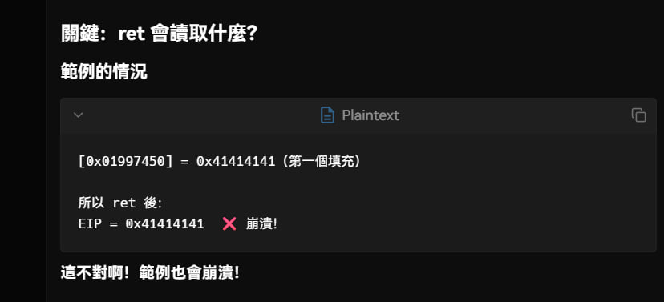
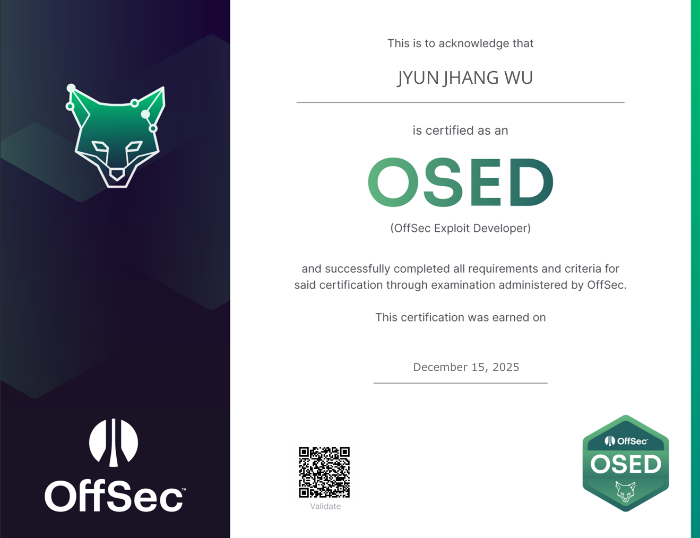

## 🦉 免責聲明
叮叮噹、叮叮噹、🔔多響亮 ~ 你看這裡有個人在聖誕節前考證照耶，如果沒考過不就只能在🎄下一個人哭了嗎 ? 幸好他有考過，他可以拿著證照一個人在🎄下哭。

沒錯，又是我，我又用奇怪的方式來考證照了。繼年初我先被 HTB Pro Lab 毒打後再去考 OSEP，年末的我這次用一週的時間與新鮮的肝考了 OSED。每考一張都在挑戰我的陽壽呢。再次奉勸看心得的各位朋友盡量不要學，但如果你想學，我正好寫了一篇手把手的 ROP Blog，你應該很容易就能找到，畢竟有一萬多字。我是說，萬一有人想拚陽壽呢 ?
## 🦉 快速總結
快速總結一下，教材總共大概掃了 0%，不能說是完全沒看，只能說是根本沒讀。反而跑去看 adr 的《Windows APT Warfare：惡意程式前線戰術指南》學 shell code。結果買完電子書沒幾天好像就版本更新了，差點沒哭出來。Challange 一題都沒打，自己跑去網路上找題目邊打邊學，這真的打到差點哭出來。

## 🦉 緣起
這個課程是我在 2024/5 臺灣的 CyberSec 上跟 OffSec 購買的。彼時的我正值碩士畢業之際，實驗過程順利，論文進展穩定。雄姿英發，羽扇綸巾，談笑間， CRTP 收入囊中。雄心壯志的我想在 OSEP 措手不及之際，趁其不備直取要害，一舉拿下。結果就因為各種事情時間來到了 2025/5。而且我手上已經有 OSEP 了，但這個課程還沒啟動。

跟各位說明一下，OffSec 的課程買了之後要在一年內啟動，不然就會直接消失。過期的🥛可能還能喝，過期的課程那是連開都開不了。這種時候，面對沒有 OSWE 與 OSED 的人，只要是個正常的 Red Team 都會選擇考 OSWE，畢竟誰會想中途轉去打 pwn。沒錯，我，一個在先前挑戰 OSWE 拿了 0 分，還放話 OSWE 比 OSEP 還要困難的人。

道理很簡單，2 月剛放完話 OSWE 很難，5 月轉頭就去考，這行嗎 ? 這不行。我的🧠在經過一番支離破碎的思考後決定控制我的右手點下了 OSED。事實證明，人類的大腦是有機會背叛的。這玩意兒有時候運作就是不正常，你又不能敲三下來修好它。

一個 2025/5 被迫啟動的 90 天課程，怎麼會 2025/12 才考呢 ? 聽到這裡，有些人一定覺得我花了半年準備。天真，太天真了，正好相反。從我點開課程的那一刻我就知道我這輩子不會喜歡 pwn 了。所以你見證的是我不斷放棄，然後不斷懷疑，最後逼不得已只能硬著頭皮上陣的故事。

## 🦉 時間軸

| 時間             | 事件                                                            | 狀態      |
| -------------- | ------------------------------------------------------------- | ------- |
| **2025/05 下旬** | 啟動 OSED 課程                                                    | 🚀 開始   |
| **2025/06 中旬** | 開始讀教材，但不怎麼好讀                                                  | 📖 學習中  |
| **2025/06 下旬** |                                                               | ❌ 第一次放棄 |
| **2025/07 中旬** | 直接開始寫 shell code                                              | 📖 學習中  |
| **2025/07 中旬** |                                                               | ❌ 第二次放棄 |
| **2025/09 上旬** | 重學怎麼寫 shell code                                              | 📖 學習中  |
| **2025/09 中旬** |                                                               | ❌ 第三次放棄 |
| **2025/10 上旬** | 沒開任何防護疊出第一個 ROP                                               | 📖 學習中  |
| **2025/10 中旬** |                                                               | ❌ 第四次放棄 |
| **2025/12 上旬** | 疊出第一個能 bypass DEP 的 ROP   寫出四種不同的 shell code               | 🎯 背水一戰 |
| **2025/12 中旬** | 疊出另外兩個能 bypass DEP 的 ROP   疊出 ROP decoder   **考到 OSED** | ✅ 成功    |

## 🦉 你還好嗎 ?

停，我知道你想說什麼，我精神狀況很 OK。你可能會覺得這傢伙 12 月受到了什麼刺激。但這不能怪我，因為 OffSec 的課程不僅要在買了之後一年內啟動，啟動之後還要在半年左右的時間內安排考試，不然就會直接消失。開玩笑，這可是一隻 iPhone 17 Pro Max。就算不買 iPhone，這也是三趟日本來回✈️。就算不去日本，這也是一年份的大麥克。這筆錢直接消失了，這能嗎 ? 這不能。那我是在什麼時候注意到這件事的呢 ? 沒錯，11/30。這把是生死局，尤其是後面還是聖誕假期，我唯一能排的時間是 12/12，我知道我必須得玩命。

我 11/30 知道要玩命，我 12/1 就把我電腦上所有會影響我的一切事物全刪了。
- 【新楓之谷】隔天還要出新職業，刪 ; 
- 【崩壞 : 星穹鐵道】貨幣戰爭還沒打完，刪 ; 
- 【Teams】老闆會找不到我，ㄕ... 等等這不能刪 ; 

反正最後硬碟被我硬生生刪了3、500 GB。我直接宣告元嬰不成我誓不出關。
我閉關的時候還不忘帶上 GPT，誰知道它比我還快崩潰 : 

但總之，我閉關就是真的從 0 開始，左手 Google 右手 GPT，在網路上找了三個 exe，把 DEP 打開，然後死命地疊 ROP。具體來說，除了我的上班時間以外，我全部都在疊 ROP。每天就是早上 9 點起床，凌晨 4 點躺下。在公司喝兩份咖啡，回家再兩份咖啡，然後想睡了就喝一瓶魔爪，就這樣硬生生疊了 10 天，直到考試前兩天才出關。你可能會疑惑為啥需要這麼拚，但我還真沒辦法，畢竟我從來沒有學過 pwn，我最多就知道塞很多 `A` 會把程式弄 crash。別人 ROP 疊 3、5 分鐘我可能要疊 3、5 小時。這種情況要拚一把，勢必得拿陽壽換。但往好處想，但凡你還剩 30 天都不需要像我這麼學。

## 🦉 結論
其實我不知道該下什麼結論，因為就連我考高中還有考大學的時候都沒有這麼閉關過。考大學的時候反而還從從容容游刃有餘。準備 OSCP & 刷 HTB 的時候我也會保證我有充足的睡眠。仔細想想，就算沒有考過，我也能夠在兩個禮拜後花錢補考。至於有些人可能會擔心，會不會我的 ROP 考完後馬上就忘了，我不敢肯定，但我有信心。畢竟在沒有任何語言模型的輔助下，將自己學習到的知識寫成一萬多字的 Blog，在動筆的那一刻就已經代表我確實學會了。

文末還是要再奉勸一下，千萬不要學，很傷身體 QQ

