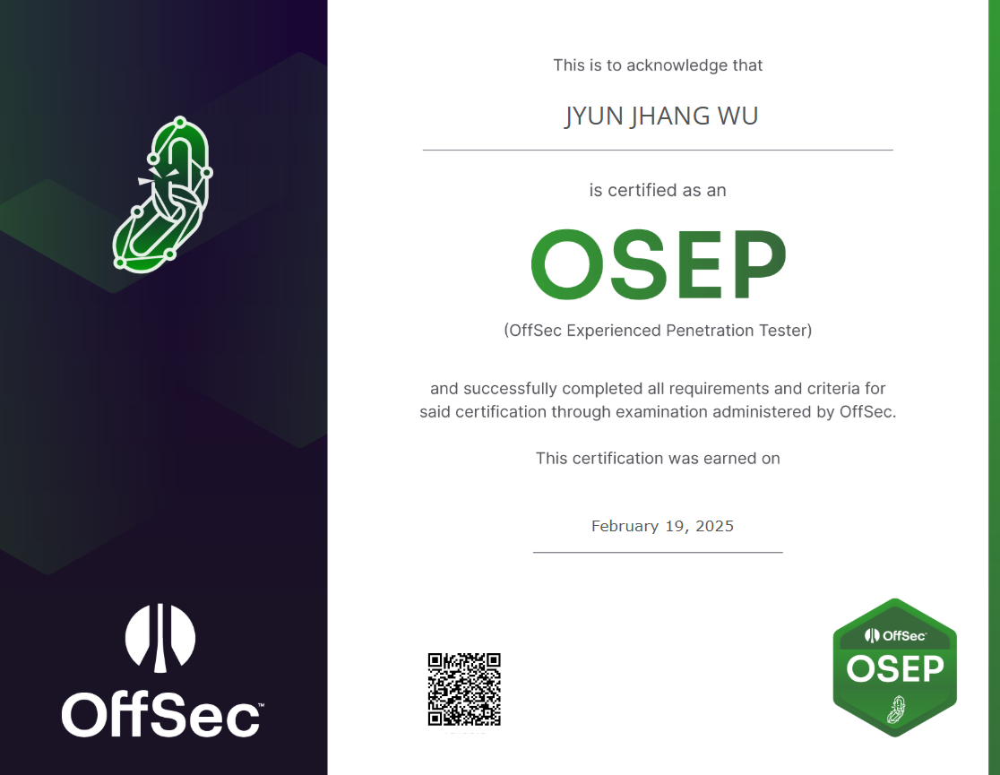

## 🦉 免責聲明
事先聲明，我認為我考 OSEP 所走的道路絕對跟正常人大相逕庭，也因此並不鼓勵其他人跟隨我的腳步。但事實上如果你選擇跟我走上相同的道路，那這張證照拿起來甚至比機車駕照還簡單，僅限考試當下啦。

## 🦉 快速總結
快速總結一下，教材總共大概掃了 60%， Challange 更是只打不到 3 組 (可能連 10 台都沒有)。考試一共拿了 15 隻 🚩，換算下來是 150 分。其中一條路直接走到底拿到了包含 `secret.txt` 在內的 10 隻 🚩，另一條路則是拿到 5 隻 🚩。共耗時 11 小時 45 分鐘及格。

## 🦉 緣起
事情的起因還要源自於某一次與 DEVCORE 的紅隊總監 Shaolin 與 DEVCORE 紅隊隊長 Ding、Vtim 的談話。那時的我才只有 OSCP & CRTP 的證照，OSEP 是我連想都不敢想的。在那一次談話中，我對於自己的技術熟練度表達了不安，這種不安源自於我對於證照與現實紅隊之間的落差。儘管費盡了千辛萬苦取得證照，但我總會不自覺的想，這些證照課程真的能夠與現實接軌嗎? 面對這種不安，我從三位得到的建議是 【把 HackTheBox 刷個 50、60 題，甚至更多，刷到你感覺一切都是老梗了，就差不多了】

也許有人會覺得他們是在開玩笑，但我是真心認為三位給予我的建議是認真的。也因此，我將這件事一直放在心上並且打算認真付諸實踐。但真想要刷也要有個方向吧? 我總得知道我刷哪種類型、哪種等級的題目。總不可能一上來就先打一個 BOSS 然後卡個三天三夜吧，練等也得循序漸進，有道理吧?

正好在機緣巧合下，我有機會**被主動**的去刷 HackTheBox Pro Lab。這不就是個完美的時間點嗎，我可以從 Easy 開始，然後是 Medium，再來是 Hard，慢慢地打上去，這樣不出半年我一定能刷到 50 題，這計畫簡直太完美了。

然後我就在兩個月內刷了 4 組 Pro Lab 差不多 60 題，起步難度是 Medium。

一定有人覺得我是在開玩笑，哈哈。

## 🦉 現在是幾點來著?
第一組 Full House，難度 Medium。是個 minilab，但區塊鍊跟 AI 這兩個從來沒碰過的領域直接拍在我臉上，其中一個 Flag 甚至用了我 3 天 3 夜才彈一個 shell 回來，彈回來那一刻我簡直快哭出來了。

第二組 Alchemy，難度 Medium。是個標準 lab，還是一個工控環境，又是沒碰過的領域跟技能點甩在我臉上。被 AD 荼毒還得接連好幾個周末看工控協定、研究工控向量。

第三組 RPG，難度 Hard。是個 minilab。打的過程可以說是哀莫大於心死，為了拿到一隻 flag 可能得串 3、4 個向量，每一隻 🚩相當於前面 lab 3 隻 🚩的量，陪伴我只有堆積起來的魔爪。

第四組 Cybernetics，難度 Hard。是個標準 lab。橫跨了 4、5 個 Domain，在 AD 之間來回奔波，把我的新年假期全部卷進去了，最痛苦的是上面還有 Defender 在阻止你的各種行為。真的是從早到晚都在電腦桌前想盡一切辦法，魔爪已經不只有一種顏色了，這個月好事多的卡因為刷魔爪刷爆了。

沒錯，這裡沒有 Easy，我沒找到捷徑，但通往 OSEP 的道路上全都是 Pro Lab 與我逝去的假日。

## 🦉 對於課程的評價
極度主觀來說，我認為 OSWE 甚至比 OSEP 難，當然，也可能是因為被毒打的領域不同。但是對於對於考試當下的我而言，我覺得甚至沒有 HackTheBox 的 Medium 難。

這部分的成因其實很單純，因為 OSEP 課程教的技術在 2025 年的現在實在擔的起古代文明技術這一詞。在課程中刻出來的 payload 餵給 2022 的 Defender 都會直接會被 kill 掉。而 AD 的部分教授得也不像 CRTP 來得多樣。當然，畢竟是 PT 課程，或多或少也有教一些攻擊向量。但很不幸的，這門課教的向量都被我在 Pro Lab 用魔爪堆出來了 (也就是說但凡我先看 OSEP 哪怕一章，我的假日都不至於消失殆盡)。具體量化表示，我認為 OSEP 應該是 70% CRTP + 50% HackTheBox medium Pro Lab 的綜合體。我相信對任何一個現役的 Red Team 而言，這張證照應該是伸手就來。而如果是對於剛完成 OSCP 想要進一步的人而言，我想還有一段路要走，綜合難度應該是中等偏上。要是我沒有經歷 Pro Lab 洗禮，我可能會中道崩殂。

## 🦉 結論
我想，回到最初的話題，我是怎麼準備 OSEP 的? 事實上可以說是沒有，從我決定考 OSEP 到考試當天只有兩週。其中還有一週被我挪去幫 OSWE 抱佛腳。我想，我能過這張證照最合理的解釋應該是用 Hack The Box 的屍體推砌而成的道路。也因此我非常不建議各位參考我的道路。這條路當然能行，因為我走完了，但這條路十分崎嶇。如果是有志想考取 OSEP 的各位，一定有更平穩的道路能夠選擇。即使只是看完教材並打完 Challenge 也足以考取。

我只是想分享一個小故事，關於我相信 Shaolin、Ding 與 Vtim 所給予的建議，並且付諸實踐，最後取得了一張證照的一個小故事。而我相信這條道路他們也同樣一路走來，並登上山巔。

