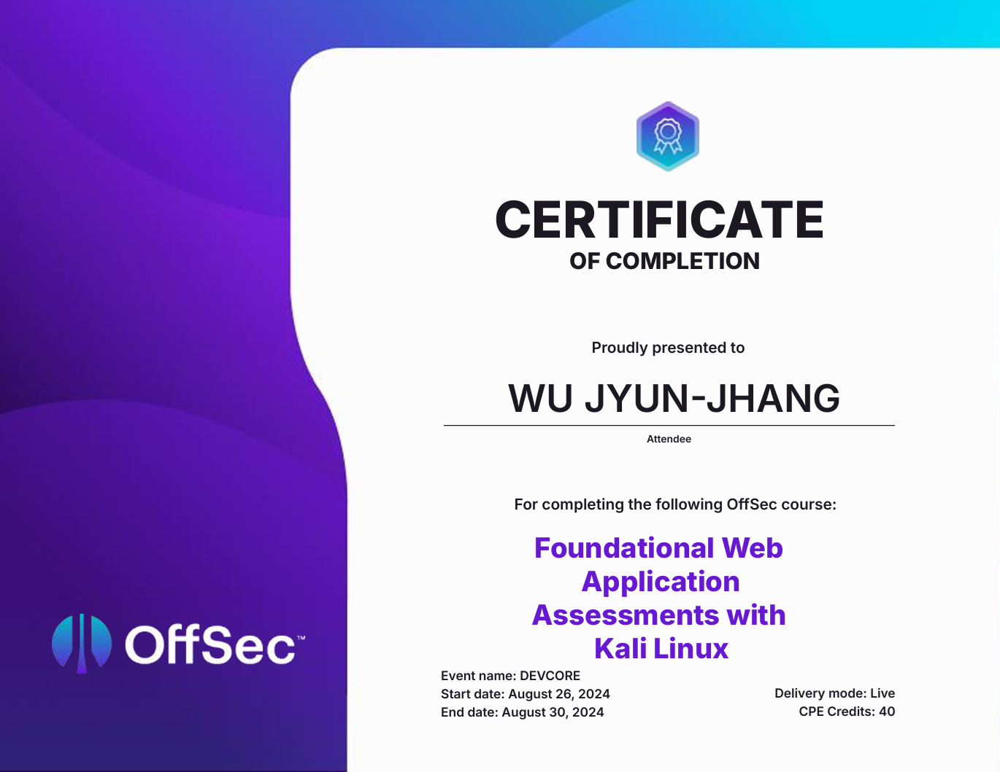

正值碩士畢業後的閒暇時光，那種從早到晚閉關做實驗的身體習慣還牢牢刻在骨子裡改不掉，正好聽說 DEVCORE x OffSec 要在臺灣第一次舉辦的 Live Training，摸了摸口袋就跑來報名了。0w0

## 🦉 收穫與課程分享

快速總結一下，課是 8/26 上的，試是 9/1 考的，證照是 9/4 拿的。前前後後剛好 10 天，連畢業跑離校都沒有這麼快 XD。因為很多人來問我 Live Training 的問題，所以我想說整理一下以及發篇心得。我想，這篇心得會以我自身的角度出發去回答問題以及一些課程想法，在看完我所敘述的內容後，不妨去多看看其他參與課程的學員心得，也許能讓你對 Live Training 有更全面的認識。

### ❓ 授課語言是否會導致理解上的困難？

Live Training 是全英文授課的。如果怕聽不懂英文，我想不必有這種擔憂，因為講師講的比多益聽力還慢而且發音咬字也更清晰。我印象最深刻的就是講師會 Cue 台下的同學回答一些問題，而回答完後，講師會回應你一個非常宏亮且完美的 **Exactly!**，我這輩子還沒聽過這麼完美的 **Exactly!**，互動體驗感極好，讓人想繼續回答問題 XD。而如果是怕聽不懂內容，我想更可以放心。事實上講師比你自己都還更怕你聽不懂，下場親自解釋以及手把手教學都是基本的，教學態度好到你都會懷疑他是不是需要你在 Google 地圖上給他個五星好評。

### ❓ 課程難度會不會太高或太低？

課程難度方面，我想可能是目前 OffSec 開設的所有 Live Training 中最簡單的了。這門課教授的內容並不會超出 OWASP TOP 10，對於產業相關人士我想是毫無壓力。而如果是非相關產業人士，我建議上課前可以稍微了解一下 OWASP TOP 10 各自的成因，但不必細究。這能夠幫助你學習到相關主題時更快進入狀況。當然，OffSec 的課程最與眾不同的地方便是極為注重實作能力，因此，除了課程上的理論知識外，會有相當大的時間提供給學員實作 Lab 練習。以我個人而言當然是求之不得，Lab 就是來一個扁一個，來兩個扁一雙。如果是平常喜歡玩遊戲蒐集全成就的人，恭喜你，這邊也有個白金獎盃 100% 全成就可以蒐集。

### ❓ 授課講師教得如何？

我想講師的專業性是無庸置疑的。除了講師以外，我也想特別提到課程的助教，事實上我隱隱覺得那位助教可能已經把 OffSec 的證照全拿下或者他其實本身就負責設計課程。有時他僅僅只是經過你身旁就知道你哪邊可能會有疑問，並且會主動教你，感覺就像是把教材都當成心法了，不僅只是教材，即使是 Lab 實作也不例外。所以，如果是害怕 Lab 做不出來的人，我有一言，請諸位靜聽，正所謂 **授課不懂問講師，Lab 不決問助教** 。講師跟助教就是周瑜跟張昭。問問不吃虧，人都特地來現場了，回家問 GPT 還要繳訂閱費，說不定也沒有這兩位回答的清晰呢。

## 🦉 個人心得

筆鋒一轉，再來就是一些我個人的上課心得了，首先是上課形式，我必須聲明，儘管這門課最終的目標是考取證照，但 Live Training 跟外界一般的證照班最不同的是，Live Training 沒有所謂的證照考試技巧、考古題等等這些很 **目的性** 的授課。我想對於受過台灣標準教育以及上過證照導向課程的人應該能很強烈感受到其差異。Live Training 本身更接近學習知識的過程而非考試。而這個特性的好壞則因人而異。

### 🐣 學習方式並非只有一種選擇

我想先分享吸收新知這一行為本身。誠如求學過程中你我所經歷過的，學習本身便是貪婪的汲取知識的體現。而在這一過程中難免會遇到撞牆期。尤其在我學習資安時，那堵牆壁更是明顯。事實上，我目前共有兩張 OffSec 的證照，包含了 OSCP 與這門 Live Training 的目標 OSWA。OSCP 是我獨自學習考取的，我必須承認，這不是個一帆風順的過程，在獨自學習中產生的各種疑惑，你都必須自行排解並得出解答。若非是我在學習 OSCP 時有志同道合的同儕一起陪我思考並解決問題，我勢必需要花費更大量的時間去學習，而 Live Training 則能避免掉這一部分的成本。

**【Teaching others teaches yourself】** 包含講師以及助教、一起學習的同學都能夠幫助你排解學習上的疑惑。當然，我並不是要分出這兩者孰優孰劣。事實上，我也十分享受一個人坐在電腦前全心全意學習的這一過程，有一種歲月靜好的餘韻在。但如果想試看看另一種有別於自我研究的學習方式，我認為參與課程會是不錯的選擇，當然，並不一定要是 Live Training，只是 Live Training 更貼近我心中所謂學習知識的樣貌，我想這一點同樣也是因人而異的。

### 🐣 對課程時間安排的取捨

接著，我想分享的是課程安排。本次的 Live Training 採用的是連續一週 5 天的密集課程。與許多機關的培訓課程或是證照課程通常會為了迎合社會人士而選擇開設在多個假日不同。事實上，我認為密集式的課程更能有效地吸收知識。原因在於，資安技術的學習是需要非常高 Concentration 的。但如果將課程內容分散，學習者會需要承受喚回記憶與遺忘的時間成本。同樣地，講師也必須將課程切分成適合假日授課的課綱，可能會導致較為困難的內容授課時間被壓縮。我想，這不論對於講師或者學習者都是非常不利的。

但密集授課也不是完美的。當然也會產生其特有的問題。有些學習者會擔心在 Live Training 期間跟不上講師授課的內容，事實上，OffSec 有提供三個月的課程教材與 Lab 練習，讓學習者在 Live Training 後能有自己沉澱學習的機會。使得這些知識並不僅僅只是你生涯的一位過客。更進一步的解釋，其實 OffSec 的教材本身便是朝向能讓學習者能在自我進修的這一過程，盡可能地有良好的體驗設計的。我想，由於教材的該特性，因此在課程安排這點上，我會更欣賞目前 Live Training 的授課方式。

### 🐣 對於這張證照的經驗分享 & 想法

最後，應該很多人關心的是證照考取相關的心得。對於 OSWA 這張證照的難度應該是眾說紛紜。許多人會說它是 OffSec 證照中最簡單的一張。也有許多人說它考起來比 OSWE (OSWA 的上位證照) 還要難上許多。我想先以我自身的角度來講述該證照的考取經驗。我從初次學習資安至今應是 3 年，並且持有一張 OSCP 證照。儘管如此，我仍認為我並非 Web Security 的專業人士。原因在於 OSCP 儘管有教授部分的 Web Security。但其更偏重於滲透測試這一流程本身。使得做為 Initial Access 中一部分的 Web Security，在 OSCP 中並沒有非常詳盡的介紹。再舉個實際的例子，我曾經面試過臺灣資安界的最耀眼的公司 DEVCORE 的實習生。而在面試過程中，我就有兩個非常基礎的 Web Security 問題沒辦法回答出來。這兩個問題我會放在文章的最後，非常歡迎沒有學習過並且有志考取 OSWA 的學習者，將這兩個問題記錄下來，並且待到學成後再嘗試回答看看。

回到話題本身，以我的角度而言，我認為這張證照的難易度很大程度取決於挑戰者本身。原因是，這張證照有許多的挑戰環節都希望你培養一個意識——【跳出框架之外】。在 Live Training 上學到的知識，或者說 OSWA 的教材所提供的知識為你的資安技術提供了堅實的基礎，足夠你考取這張證照。然而還有更重要的一點是意識的培養。事實上，很多資安的風險往往在不經意間、在預想不到的地方產生了星火，於是在檯面下慢慢地釀成燎原之勢，釀成大禍。而能否及時在星火初生之際發現並將其扼殺，我認為便是這張證照想考驗測試者的能力。因此，我認為單論 OSWA 這張證照在考取上，對於既有技術者而言，Live Training 事實上並沒有太大的助益，你仍然需要透過課程中的 Lab 實作來培養你的意識。但對於初心者而言，Live Training 能夠幫助你將撲滅火勢的一切所需準備好，而你只需要全心全意地尋找那可能導致燎原之勢的起火點。我想，這張證照對你而言，便是唾手可得之物。

## 🦉 結論

在遭受實驗與論文口試的洗禮下，能全心全意的學習一門知識的時間越發覺得彌足珍貴。特別是自己有興趣的事物，學習起來更加得心應手。感謝舉辦本次的 Live Training 的 DEVCORE 與 OffSec。讓我最後還能回憶起美好的朝九晚六高中生時光。

## 🎃DEVCORE 面試時的兩個問題

- 你知道 XXE 是什麼嗎?
- 同源的定義是指什麼? Domain、協定、埠這些有差嗎?
