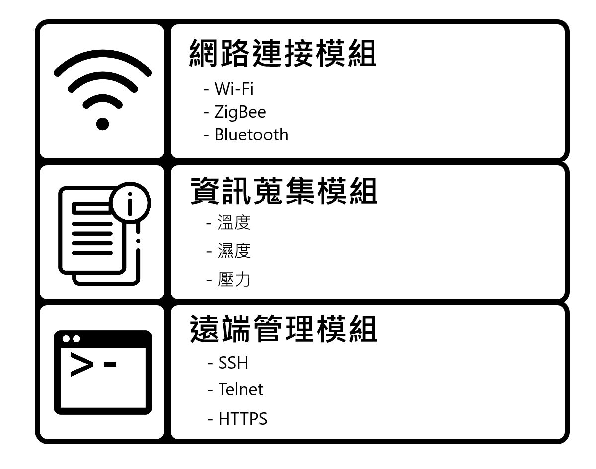

## 🦉IoT 設備基本概念

### 🐧IoT 設備的定義

物聯網 (Internet of Things，IoT) 設備是指通過在各種設備中嵌入感測器、軟體和網路模組等，具有通過網路控制與資訊傳輸的能力的設備。IoT 設備的發展與設計在近年來逐步改變我們的生活，截至 2021 年，IoT 設備的數量已達到 100 億台以上。IoT 設備通常具有以下三種模組，包含網路連接模組、資訊蒐集模組、遠端管理模組，透過三種模組與現實世界的設備結合，實現龐大的 IoT 網路架構。

**網路連接模組**：IoT 設備通過各種協定，例如：Wi-Fi、ZigBee、Bluetooth 等與網際網路連接，從而實現資訊傳輸。

**資訊蒐集模組**：IoT 設備配備各種感測器，可以感知並蒐集自身或環境資料，例如：溫度、濕度、壓力、座標等。

**遠端管理模組**：IoT 設備能夠通過網際網路實現遠端管理和控制，使用者可以透過應用程式或網頁介面監控設備狀態，並控制其功能。

### 🐧常見 IoT 設備

IoT 設備作為物聯網的核心組成部分，涵蓋從民生需求到工業控制的領域。包含居家設備、工業設備、穿戴式裝置、交通設備、農業設備等。

**智慧穿戴設備**：智慧穿戴設備通常是指可以配戴在身體上的智慧設備，例如：智慧手環、智慧手錶等。這類 IoT 設備可以蒐集身體的各項健康資料，例如：心率、睡眠質量、行走步數、運動模式等。並透過連接到智慧型手機或網際網路來提供個人化的健康監測和提醒。

**智慧居家設備**：智慧居家設備通常是指用於實現智慧住宅概念的居家自動化和智慧控制設備。這類 IoT 設備的設計目的是將居家常用的各種設備控制方式結合並統一化，以達成智慧化與便利化的目的。這類設備可以包含智慧插座、智慧燈泡、智慧門鎖、智慧監控等。透過網際網路連接，使用者可以遠端監控並控制這些設備，達成節能、安全、便利的居住生活。

**智慧交通設備**：智慧交通設備通常是指用於改進交通運輸系統效率和安全性的設備。這類 IoT 設備包含智慧交通號誌、智慧車輛、交通監測系統等。它們可以通過網際網路連接，實現交通流量監測、路況預測、導航和交通管理，從而減少交通壅塞與提高交通安全性。

**智慧農業設備**：智慧農業設備用於農業生產過程的監控和管理。這類 IoT 設備包含土壤濕度感測器、氣象站、智慧灌溉系統等。能夠有效管理農場、降低人力成本。

**工業監控設備**：工業監控設備通常是指用於監測和控制工業過程和裝置的設備。這類 IoT 設備可以包括感測器、工業機器、監控系統等。通常用於蒐集環境資料、監測設備運作狀態、遠端監控和故障檢測。被大量使用在輔助供應鏈提高生產效率以及品質控管。

## 🦉IoT 設備安全挑戰

### 🐧IoT 設備安全的重要性

隨著越來越多的 IoT 設備連接到網際網路，如何保護這些 IoT 設備免受潛在威脅成為當前重要的議題。儘管 IoT 設備的方便能夠為我們的生活帶來許多好處，但也由於 IoT 設備的特性，使得這些設備不易防禦駭客的攻擊。這些特性包含：成本問題、更新問題、開發問題、管理問題等。

**成本問題**：在 IoT 設備製造上，為了降低成本，一些 IoT 設備製造商會優先考慮設備的功能性，而忽略了安全性。由於需要盡可能壓低硬體成本，這也導致 IoT 設備上的硬體效能通常不足以負擔端點防護等相關的防禦軟體。

**更新問題**：由於 IoT 設備各自適用於不同領域且沒有明確的開發規範與統一性，且生命週期與維護也由製造商自行訂定。因此及時更新和升級數量龐大的 IoT 設備軟韌體是非常困難的。如果某些 IoT 設備被發現安全風險或漏洞，使用者無法及時更新，可能導致這些有漏洞的 IoT 設備成為駭客攻擊的首要目標。

**開發問題**：為了節省硬體儲存空間及閉源考量，某些 IoT 設備製造商通常會避免使用開源的作業系統，而是使用自己封裝的函式庫 (Library)，這些函式庫如果沒有經過完整的安全測試，就有可能被駭客透過逆向工程 (Reverse Engineering) 等手法找出可利用的弱點，使這些 IoT 設備受到攻擊。而由於在 IoT 設備開發時，通常會大量疊代先前的開發經驗，為避免相容性問題， IoT 設備製造商會使用較舊的編譯環境，以導致在編譯時的安全防護，例如：PIE、NX、Stack Canary 等被關閉。此外，由於不同的 IoT 設備製造商可能使用多種不同版本的軟體套件來加速開發流程，如果沒有正確設定這些軟體套件，也可能成為 IoT 設備安全上的破口。

**管理問題**：IoT 設備龐大的數量，使其管理上也成為一門問題。如果有 IoT 設備連接上內部網路卻沒有被正確管理導致被駭客入侵，駭客就能利用內部網路橫向移動的手法，將被入侵的 IoT 設備做為跳板去攻擊內部網路的其他設備。由於 IoT 設備在功能正常運作的情況下，鮮少會有管理者進入內部系統檢查，也因此被駭客打下的 IoT 設備通常可以在內部網路潛伏數年之久。

### 🐧OWASP

OWASP (Open Web Application Security Project) 是一個開放的社群非營利組織，致力於研究網際網路應用程式安全的標準、工具和技術，協助政府和企業理解並改善應用程式的安全性。

OWASP 最著名的是一份針對網路應用程式安全性的排名 —— OWASP Top 10。它列出了目前最常見的十個網路應用程式安全風險，提供給開發人員、測試人員和資安人員作為指南以確保應用程式的安全防護。OWASP Top 10 在各個領域都受到重視，包含：企業、政府和學術界等。OWASP Top 10 的目的是提醒人們注意常見的網路應用程式漏洞，以便開發更加安全和可靠的應用程式。
